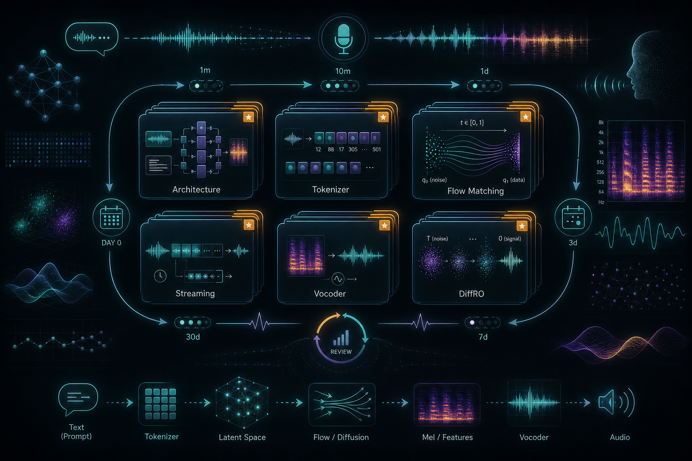

# CosyVoice 系列 Anki 卡片

复习提示：先把 Tokenizer、LLM、Flow、Streaming、DiffRO 五个锚点记牢，再刷下面的单点卡片。

## Card
Q: CosyVoice 1 的一句话核心思路是什么？
A: 用监督语义 speech token 连接 LLM 的 text-to-token 生成和 Conditional Flow Matching 的 token-to-mel 渲染，实现零样本 TTS。
Tags: TTS/CosyVoice/core

## Card
Q: CosyVoice 系列中 LLM 主要负责什么？
A: 主要负责根据文本、指令和参考条件生成离散 speech token，不直接生成 waveform。
Tags: TTS/CosyVoice/architecture

## Card
Q: CosyVoice 系列中 Flow Matching 主要负责什么？
A: 根据 speech token 和说话人/参考条件生成连续 Mel spectrogram。
Tags: TTS/CosyVoice/flow-matching

## Card
Q: CosyVoice 系列中 vocoder 主要负责什么？
A: 将 Mel spectrogram 还原成最终 waveform。
Tags: TTS/CosyVoice/vocoder

## Card
Q: CosyVoice 1 为什么引入监督语义 speech token？
A: 为了让 speech token 与文本语义更对齐，从而提升内容一致性和零样本 voice cloning 稳定性。
Tags: TTS/CosyVoice/tokenizer

## Card
Q: S3 token 与普通 acoustic codec token 的关键区别是什么？
A: S3 token 偏语义和文本对齐；acoustic codec token 偏声学重建。
Tags: TTS/CosyVoice/tokenizer

## Card
Q: CosyVoice 1 的 S3 tokenizer 如何得到离散 speech token？
A: 在 ASR encoder 中间插入 VQ，把 hidden representation 映射到 codebook index。
Tags: TTS/CosyVoice/tokenizer

## Card
Q: CosyVoice 1 中 speaker embedding 的作用是什么？
A: 向 LLM/CFM 提供说话人音色条件，让 speech token 更专注于内容和韵律。
Tags: TTS/CosyVoice/speaker

## Card
Q: CosyVoice 1 的主要非流式限制是什么？
A: 需要完整生成 speech token 和 Mel 后再输出，不适合低首包延迟的实时交互。
Tags: TTS/CosyVoice/limitations

## Card
Q: CosyVoice 2 解决的核心工程问题是什么？
A: 在保持高质量的同时支持 streaming TTS，降低交互式语音合成的首包延迟。
Tags: TTS/CosyVoice/streaming

## Card
Q: CosyVoice 2 为什么移除 text encoder？
A: 为了简化架构，并允许直接使用预训练文本 LLM 作为 text-speech LM backbone。
Tags: TTS/CosyVoice/architecture

## Card
Q: CosyVoice 2 为什么移除 LM 侧 speaker embedding？
A: 为了减少 speaker 信息对 LM 内容建模的干扰和 ICL 信息泄漏。
Tags: TTS/CosyVoice/speaker

## Card
Q: CosyVoice 2 中 FSQ 替代 VQ 的主要收益是什么？
A: 提高 codebook 利用率，保留更多内容信息和上下文变化，从而提升内容一致性。
Tags: TTS/CosyVoice/FSQ

## Card
Q: CosyVoice 2 的 unified text-speech LM 如何支持流式？
A: 通过按预设比例混合 text token 和 speech token，让模型边读文本边生成 speech token。
Tags: TTS/CosyVoice/streaming

## Card
Q: CosyVoice 2 的 chunk-aware Flow Matching 为什么重要？
A: 它让同一个 CFM 可以在 non-streaming 高质量和 streaming 低延迟之间切换。
Tags: TTS/CosyVoice/flow-matching

## Card
Q: CosyVoice 2 中 non-causal mask 适合什么场景？
A: 适合离线、延迟不敏感、追求最高质量的场景。
Tags: TTS/CosyVoice/streaming

## Card
Q: CosyVoice 2 中 full-causal mask 适合什么场景？
A: 适合极低延迟的流式合成场景。
Tags: TTS/CosyVoice/streaming

## Card
Q: CosyVoice 2 的流式版本在 hard set 上为什么会退化？
A: 流式模式可见上下文更少，复杂文本和长尾样本更容易出现内容一致性问题。
Tags: TTS/CosyVoice/limitations

## Card
Q: CosyVoice 2 中 instruction control 不能自然涌现的证据是什么？
A: 去掉 instruction 后 MOS-I 从 4.06 降到 2.28，说明指令控制需要显式训练数据。
Tags: TTS/CosyVoice/instruction

## Card
Q: CosyVoice 2 在日语上表现较差的主要原因是什么？
A: 日语和中文字符集存在重叠，容易导致日语上下文中出现中文发音混淆。
Tags: TTS/CosyVoice/multilingual

## Card
Q: CosyVoice 3 的核心目标是什么？
A: 面向真实场景的多语种 zero-shot speech generation，覆盖长尾文本、跨语种、情绪和多领域数据。
Tags: TTS/CosyVoice/CosyVoice3

## Card
Q: CosyVoice 3 的 tokenizer 相比 CosyVoice 2 有什么升级？
A: 从 MinMo 派生，使用 ASR、LID、SER、AED、SA 等多任务监督训练。
Tags: TTS/CosyVoice/tokenizer

## Card
Q: CosyVoice 3 为什么使用多任务 speech tokenizer？
A: 为了让 speech token 不只保留文本语义，也更好承载语言、情绪、音频事件和说话人相关信息。
Tags: TTS/CosyVoice/tokenizer

## Card
Q: CosyVoice 3 的 DiffRO 主要优化对象是什么？
A: 直接优化 LLM 预测的 speech token logits，而不是完整音频 waveform。
Tags: TTS/CosyVoice/DiffRO

## Card
Q: DiffRO 为什么比音频级 RL 更适合 CosyVoice 这类系统？
A: 因为它绕过 CFM 和 vocoder 的高成本音频采样，在 token 级用可微 reward 反传。
Tags: TTS/CosyVoice/DiffRO

## Card
Q: DiffRO 中 Token2Text reward 主要约束什么？
A: 约束生成 speech token 能被还原出正确文本，从而提升内容一致性。
Tags: TTS/CosyVoice/DiffRO

## Card
Q: DiffRO 为什么需要 KL 约束？
A: 防止模型为了最大化 reward 过度偏离 reference model，降低 reward hacking 风险。
Tags: TTS/CosyVoice/DiffRO

## Card
Q: DiffRO 的一个主要风险是什么？
A: 可能优化某个 reward 后损害 speaker similarity、发音或情绪等其他指标。
Tags: TTS/CosyVoice/limitations

## Card
Q: CosyVoice 3 中 pronunciation inpainting 解决什么问题？
A: 解决多音字、稀有词、人名地名等发音不可控或易错的问题。
Tags: TTS/CosyVoice/pronunciation

## Card
Q: CosyVoice 3 如何支持 pronunciation inpainting？
A: 训练词和 phoneme / pinyin 混合序列，让推理时可插入显式发音约束。
Tags: TTS/CosyVoice/pronunciation

## Card
Q: CosyVoice 3 的 self-training for text normalization 解决什么问题？
A: 减少手写 TN 规则覆盖不足，让模型更稳地处理 raw text、数字和特殊符号。
Tags: TTS/CosyVoice/TN

## Card
Q: CosyVoice 3 的数据 scaling 覆盖了哪些维度？
A: 语言、方言/口音、领域、风格、文本格式、稀有案例和自训练数据。
Tags: TTS/CosyVoice/scaling

## Card
Q: CosyVoice 3 的模型 scaling 主要体现在哪里？
A: text-to-speech LM 从 0.5B 扩到 1.5B，CFM 从 100M 扩到 300M 并采用 DiT backbone。
Tags: TTS/CosyVoice/scaling

## Card
Q: CosyVoice 3 中 DiT-based CFM 的作用是什么？
A: 作为更大容量的 Flow Matching backbone，将 speech token 渲染为 Mel spectrogram。
Tags: TTS/CosyVoice/flow-matching

## Card
Q: CosyVoice 3 为什么要建设 CV3-Eval？
A: 传统评测不足以覆盖真实场景中的多语种、跨语种、情绪、表达性和方言长尾问题。
Tags: TTS/CosyVoice/evaluation

## Card
Q: CV3-Eval 的 cross-lingual voice cloning 与 multilingual cloning 有何不同？
A: cross-lingual 要求参考语音语言和目标文本语言不同，同时保持说话人特征。
Tags: TTS/CosyVoice/evaluation

## Card
Q: CosyVoice 3 在情绪克隆上暴露了什么问题？
A: text-unrelated 情绪准确率明显下降，说明模型仍强依赖文本情感线索。
Tags: TTS/CosyVoice/emotion

## Card
Q: CosyVoice 3 为什么仍不擅长 singing voice？
A: 论文认为需要在 tokenizer 和 LM 训练阶段加入 singing data；当前数据覆盖不足。
Tags: TTS/CosyVoice/limitations

## Card
Q: CosyVoice 2 和 3 都不能通过文本指令充分控制什么？
A: timbre 等声学特征。
Tags: TTS/CosyVoice/limitations

## Card
Q: CosyVoice 系列中内容一致性常用什么指标评估？
A: 中文常用 CER，英文常用 WER，通常用 ASR 转写结果与目标文本比较。
Tags: TTS/CosyVoice/evaluation

## Card
Q: CosyVoice 系列中 speaker similarity 常用什么方式评估？
A: 用 speaker verification 模型提取参考语音和生成语音 embedding，再计算相似度。
Tags: TTS/CosyVoice/evaluation

## Card
Q: 为什么 speaker similarity 指标在不同论文/模型间要谨慎比较？
A: 不同 SV 模型会给出不一致结果，评测模型本身会影响结论。
Tags: TTS/CosyVoice/evaluation

## Card
Q: CosyVoice 系列中的 hybrid system 指什么？
A: 自回归 LLM 生成离散语义 token，再由非自回归 Flow Matching 渲染连续声学特征。
Tags: TTS/CosyVoice/architecture

## Card
Q: CosyVoice 1 到 2 的最关键变化是什么？
A: 从高质量离线骨架升级为可流式、可直接复用预训练 LLM、使用 FSQ tokenizer 的系统。
Tags: TTS/CosyVoice/evolution

## Card
Q: CosyVoice 2 到 3 的最关键变化是什么？
A: 从低延迟高质量系统升级为多语种真实场景系统，引入多任务 tokenizer、DiffRO 和大规模 scaling。
Tags: TTS/CosyVoice/evolution

## Card
Q: 为什么 CosyVoice 系列不让 speech token 保留全部声学信息？
A: 这样可减少声学干扰，让 LLM 更专注文本内容，音色和细节交给 CFM/参考条件恢复。
Tags: TTS/CosyVoice/tokenizer

## Card
Q: CosyVoice 中 ASR re-ranking 的作用是什么？
A: 在离线多次采样中选择 ASR 错误率更低的候选，以提升内容一致性。
Tags: TTS/CosyVoice/inference

## Card
Q: ASR re-ranking 的主要局限是什么？
A: 增加推理成本和延迟，不适合强实时场景。
Tags: TTS/CosyVoice/inference

## Card
Q: 生产级 TTS 为什么需要 pronunciation inpainting 这类机制？
A: 因为人名、地名、品牌名和多音字不能完全依赖模型从上下文自动读对。
Tags: TTS/CosyVoice/engineering

## Card
Q: CosyVoice 系列对工程落地最重要的架构启发是什么？
A: 将内容建模、声学渲染和波形还原模块化，分别用 LLM、CFM、vocoder 处理。
Tags: TTS/CosyVoice/engineering

## Card
Q: 学 CosyVoice 系列时最应该先掌握哪条主线？
A: supervised semantic token 如何作为中间表示，把文本语义生成和声学渲染解耦。
Tags: TTS/CosyVoice/review
