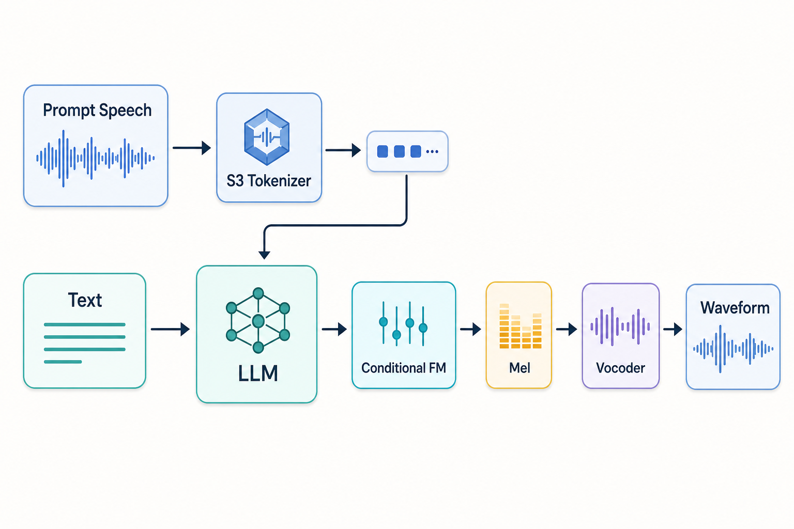

# CosyVoice 1 - 监督语义 Token 的可扩展零样本 TTS

## 一句话总结

CosyVoice 1 用监督 ASR 模型中插入 VQ 得到的 S3 语义 speech token，连接自回归 LLM 的 text-to-token 生成和条件 Flow Matching 的 token-to-mel 生成，从而提升零样本语音克隆的内容一致性、说话人相似度和可扩展性。

## 图解

- 这张图重点看三段职责分工：S3 tokenizer 负责把参考语音变成语义 token，LLM 负责 text-to-token，CFM + vocoder 负责声学渲染和波形还原。
- 复习时不要把 LLM 误认为直接生成音频；它生成的是离散 speech token。
- 这张流程图已按统一信息图规范重绘，用于辅助建立直觉；精确术语和链路以正文描述为准。

## 研究问题

- 现有 LLM-based TTS 多使用无监督 codec / self-supervised token，token 与文本语义对齐不强，容易带来内容错误。
- 纯 codec token 更偏声学重建，未必适合让 LLM 建模文本到语音的语义序列。
- 零样本 TTS 需要同时处理文本内容、韵律/风格、说话人音色；如果全部压进同一 token，建模负担会变重。
- 论文试图回答：能否用监督语义 speech token 作为中间表示，让 LLM 负责语义和韵律，Flow Matching 负责声学细节和音色。

## 核心贡献

- 首次将监督 speech token 系统性引入 TTS：从 ASR encoder 中插入 VQ，得到与文本语义更对齐的 S3 token。
- 提出 CosyVoice 两阶段骨架：Text -> LLM 生成 speech token -> Conditional Flow Matching 生成 Mel -> HiFi-GAN vocoder 生成波形。
- 通过 x-vector / speaker embedding 将说话人信息从语义 token 中分离出来，减少 speech token 对音色的负担。
- 支持 zero-shot in-context learning、跨语种 voice cloning、instruction generation，以及笑声、呼吸、强调等细粒度副语言控制。
- 证明数据规模扩大可以显著提升生成质量，说明该路线具备 scaling 潜力。

## 方法框架

- S3 tokenizer 把语音离散化为语义 token。
- LLM 建模文本编码、speaker embedding、prompt speech token 和目标 speech token 的自回归序列。
- Conditional Flow Matching 以生成的 speech token、speaker embedding、masked Mel 为条件，学习从噪声到 Mel 的连续流。
- Vocoder 只负责从 Mel 还原 waveform。

## 模型结构

- Text Encoder：BPE 后进入 text encoder，用于把文本 token 映射到更接近 speech token 的语义空间。CosyVoice 1 仍保留 text encoder；后续 CosyVoice 2 会移除它。
- S3 Speech Tokenizer：基于 SenseVoice / Conformer ASR encoder；在 encoder 中间插入 VQ codebook；论文使用单 codebook，大小 4096。
- LLM：将 TTS 形式化为自回归 speech token 生成；训练时 teacher forcing，只计算 speech token 和 EOS 的交叉熵。
- Conditional Flow Matching：用 OT-CFM 学习 Mel 分布；条件包括 speaker embedding、speech tokens、masked Mel。
- Vocoder：使用 HiFi-GAN 从 Mel spectrogram 合成 waveform。

## 训练与推理流程

- 训练 ASR tokenizer：在 ASR encoder 中插入 VQ，使 token 保留语义识别能力。
- 构造 LLM 序列：[S, speaker embedding, text encodings, T, speech tokens, E]。
- 训练 LLM：自回归预测 speech token。
- 训练 OT-CFM：以 speech token 和 speaker embedding 为条件生成 Mel。
- 训练 instruction 版本：加入 speaker identity、speaking style、emotion、paralinguistic tags 等指令数据。
- 推理时输入待合成文本和参考语音，先生成 speech token，再由 CFM 生成 Mel，最后由 HiFi-GAN 输出 waveform。
- 离线场景可使用 ASR re-ranking 降低内容错误率。

## 实验结果

- Tokenizer 语义保留：LibriTTS 上，Conformer 插入 VQ 后 WER 从 2.89 / 6.57 变为 3.18 / 7.56，性能只小幅下降，说明离散 token 仍保留较强语义。
- 多语种 S3 token 在 Common Voice zh-CN 上相对 Whisper-Large V3 有更低错误率，说明监督 token 与语义内容相关。
- LibriTTS test-clean：大规模 CosyVoice 的 WER 为 3.17%，speaker similarity 为 69.49，接近原始人声 3.01% / 69.67。
- 英文 LibriTTS：CosyVoice WER 2.89%，SS 74.30；ASR re-ranking 后 WER 降到 1.51%。
- 中文 AISHELL-3：CosyVoice CER 3.82%，SS 81.58；ASR re-ranking 后 CER 降到 1.84%。
- 情绪控制：CosyVoice-instruct 对 sad、angry、surprised、disgusted 等情绪准确率明显高于 base。
- 数据生成：用 CosyVoice 合成数据增强 ASR，Librispeech + Syn on LS, MLS text 可将 test-clean WER 从 2.79 降到 2.04。

## 工程价值

- 把 TTS 拆成语义 token 生成和声学渲染，降低单一模型同时学习内容、韵律、音色的难度。
- 监督语义 token 更适合内容一致性要求高的语音生成场景，例如语音助手、播报、配音。
- CFM 不需要传统 phonemizer、duration predictor、forced aligner，工程链路更短。
- ASR re-ranking 可以作为离线高质量合成的工程增强手段。
- 合成数据可用于 ASR / S2ST 数据增强，但要注意合成语音分布偏差。

## 局限性

- 论文没有单独设置 Limitations 章节；以下为从实验和方法中可见的限制。
- CosyVoice 1 不是流式架构，交互式语音聊天中的首包延迟未被系统解决。
- 使用 text encoder、speaker embedding、LLM、CFM、vocoder 多模块级联，部署链路仍较复杂。
- ASR re-ranking 只适合离线或低延迟不敏感场景。
- 情绪和副语言控制依赖指令数据覆盖，泛化到未见风格时论文未明确说明。
- 对日语、韩语等更大规模多语种覆盖，CosyVoice 1 论文未充分展开。

## prerequisite / related / confusing_with

### prerequisite

- [Speech Tokenizer](prerequisites.md)
- [Vector Quantization](prerequisites.md)
- [ASR Encoder](prerequisites.md)
- [Autoregressive Language Model](prerequisites.md)
- [Conditional Flow Matching](flow-matching.md)
- [Neural Vocoder](prerequisites.md)
- [Zero-shot TTS](prerequisites.md)

### related

- [CosyVoice 2 - 可流式的大语言模型 TTS](cosyvoice-2.md)
- [CosyVoice 3 - 面向真实场景的多语种语音生成](cosyvoice-3.md)
- <code>VALL-E</code>
- <code>Seed-TTS</code>
- <code>F5-TTS</code>
- <code>SenseVoice</code>

### confusing_with

- Supervised semantic token vs codec token：前者偏语义和文本对齐，后者偏声学重建。
- LLM vs CFM：LLM 预测离散 speech token，CFM 渲染连续 Mel。
- Speaker embedding vs speech token：speaker embedding 承担音色条件，speech token 主要承担内容和部分韵律。
- ASR re-ranking vs 模型本身能力：re-ranking 是推理时后处理，不等于单次采样质量。

## 我需要重点掌握的知识点

- CosyVoice 的核心范式不是 LLM 直接生成音频，而是 LLM 生成语义 speech token + Flow Matching 渲染声学特征。
- 监督 speech token 的价值在于提高 text-speech alignment 和内容一致性。
- 语义 / 音色 / 声学细节的解耦是 CosyVoice 系列的主线之一。
- CFM 在这里承担 token-to-mel 的生成，不是直接做 text-to-speech。
- CosyVoice 1 的瓶颈主要在非流式、多模块复杂、语言覆盖和指令控制范围。
