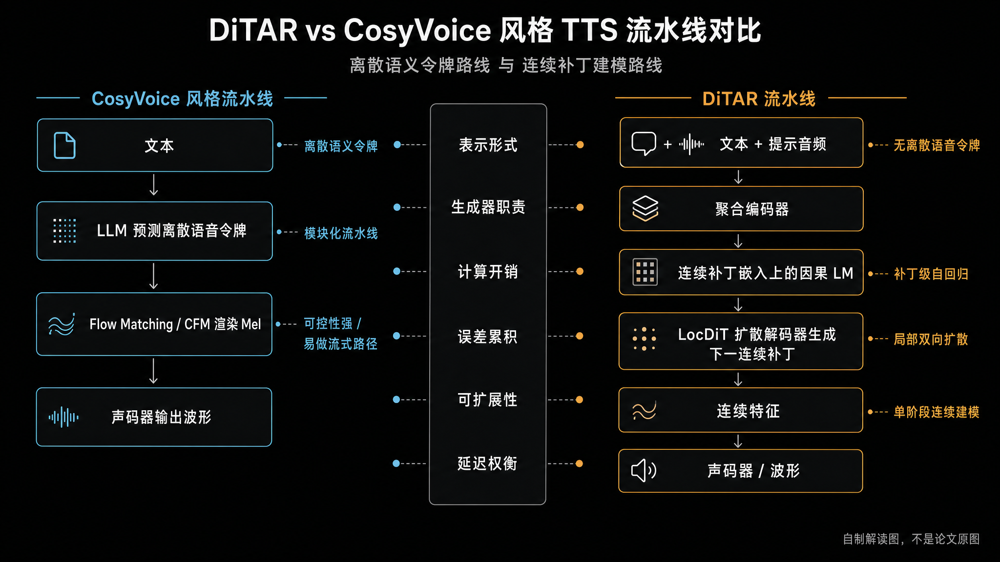
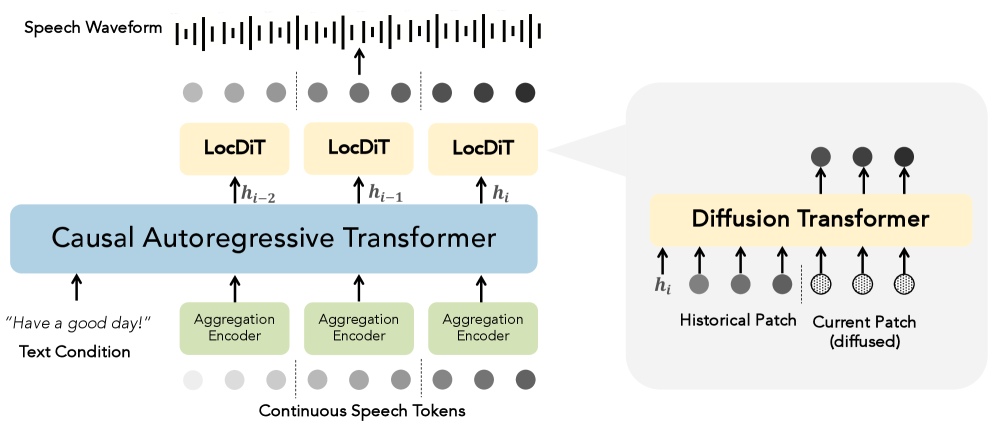
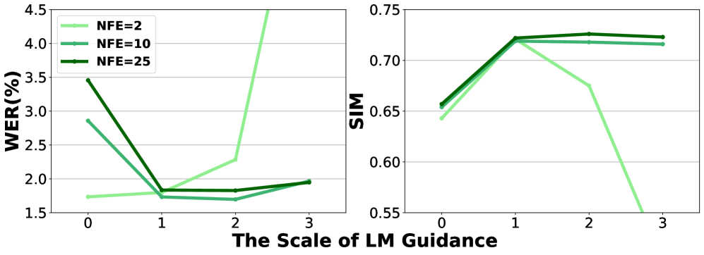
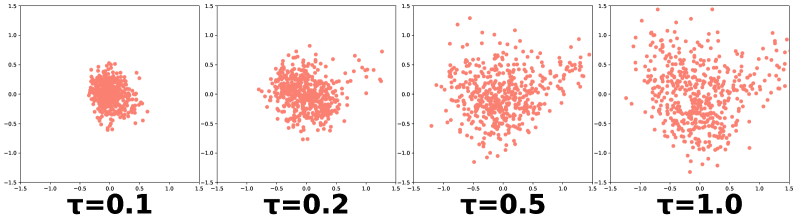
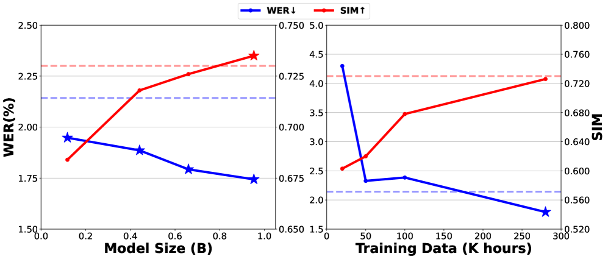

# DiTAR - 连续语音表示的扩散 Transformer 自回归建模

## 一句话总结

DiTAR 把 TTS 的中间表示从离散 speech token 转向连续 speech latent：语言模型只负责跨 patch 的自回归规划，局部连续细节交给双向 Diffusion Transformer（LocDiT）生成，从而绕开离散 tokenizer 的信息瓶颈，并在论文报告的 Seed-EN / Seed-ZH 客观指标上优于 CosyVoice 1/2；但论文没有开放源码，也没有和 CosyVoice 3 做直接对比，所以工程可复现性和生产流式能力仍要保守看待。

## 论文信息与证据边界

- 论文：DiTAR: Diffusion Transformer Autoregressive Modeling for Speech Generation，arXiv:2502.03930。
- 任务：zero-shot TTS，输入文本和 prompt speech，生成目标说话人风格的语音。
- 作者声称：DiTAR 在鲁棒性、speaker similarity、自然度和计算量之间取得更优折中。
- 证据来源：本文只使用论文原文、原文图表和项目页公开 demo 信息；没有源码的实现细节只写成机制解读或伪代码，不写成官方代码。
- 重要限制：论文 Table 3 只直接比较 CosyVoice 和 CosyVoice 2，没有比较 CosyVoice 3；因此不能据此说 DiTAR 全面优于 CosyVoice 3。

## 图解

- 这张图是基于论文原理和 CosyVoice 系列笔记生成的解读图，用于建立直觉，不是论文原图。
- 左侧 CosyVoice 路线强调“文本到离散 speech token，再由 Flow/CFM 渲染声学特征”。
- 右侧 DiTAR 路线强调“文本和 prompt 条件驱动连续 latent patch 的自回归扩散生成”。
- 精确结构以论文 Figure 1 和正文公式为准。

论文 Figure 1 明确给出三块结构：aggregation encoder、causal language model backbone、LocDiT diffusion decoder。这个图是理解 DiTAR 的核心。

## 为什么这篇论文重要

CosyVoice 系列代表的是 LLM-based TTS 的一条主线：先把语音压成离散 speech token，再让 LLM 像生成文本 token 一样生成 speech token，最后用 CFM/vocoder 还原声音。这个路线工程上很自然，但中间存在一个关键瓶颈：离散 tokenizer 必须把连续语音压到有限 code 空间，压缩得越狠，声学细节越容易丢；code 越细，序列越长、训练越难。

DiTAR 的切入点正好相反：不强行把语音表示离散化，而是保留连续 latent，让 LM 和 diffusion transformer 分工。LM 负责“长程语义和上下文规划”，LocDiT 负责“局部连续细节生成”。这让它更像把 AR 语言模型的可扩展性和扩散模型的高保真连续生成能力接在一起。

## 核心问题：连续 token 为什么不能直接用普通 AR LM

论文的关键判断是：连续语音 latent 的相邻帧高度相关，局部区域天然需要双向建模。如果直接让 causal LM 一个连续帧一个连续帧地生成，模型只能看左侧历史，无法同时利用当前局部 patch 内的前后相关性；而这些局部相关性恰恰决定语音的平滑性、音色细节和声学连续性。

论文把连续序列写成：

$$
p_{\theta}(\boldsymbol{x}_{1:N}) = \prod_i p_{\theta}(\boldsymbol{x}_i \mid \boldsymbol{x}_{<i})
$$

但它进一步把局部连续 token 聚合成 patch，模型拆成两部分：

$$
p_{\theta_a}(\boldsymbol{h}_i \mid \boldsymbol{x}_1, \boldsymbol{x}_2, ..., \boldsymbol{x}_i)
$$

负责跨 patch 的自回归上下文建模；以及：

$$
p_{\theta_b}(\boldsymbol{x}_{i+1}, ..., \boldsymbol{x}_{i+P} \mid \boldsymbol{h}_i)
$$

负责下一个 patch 内部的双向连续生成。这里 $P$ 是 patch size，$\boldsymbol{h}_i$ 是 LM 输出给 LocDiT 的条件。

## DiTAR 架构怎么跑

一次生成可以理解成四步：

1. VAE tokenizer 把 24kHz waveform 压成 40Hz、64 维连续 latent。
2. 连续 latent 按 patch 分组，每个 patch 送入 aggregation encoder。
3. aggregation encoder 用一个 learnable special token 聚合 patch，special token 对应位置的输出作为 patch embedding。
4. causal LM 读取 patch embedding 序列，输出 $\boldsymbol{h}_i$；LocDiT 在 $\boldsymbol{h}_i$ 条件下扩散生成下一个连续 latent patch。

论文实现里，DiTAR 三个模块都是 Transformer：

- aggregation encoder：双向 attention。
- LM：causal attention。
- LocDiT decoder：双向 attention。
- 三者都使用 Pre-Norm、RMSNorm 和 RoPE。
- LocDiT 输入包括 LM 输出、time embedding、historical context patches 和 noisy target tokens。
- 训练计算 loss 时，只对 noisy target tokens 对应位置计算损失。
- 训练时以 0.1 概率把 LM 输出替换成全零向量，用来支持 LM guidance。

## LocDiT：为什么要引入历史 patch

论文说 LocDiT 直接根据 AR 输出预测下一个 patch 会困难，所以加入 historical patches 作为 prefix input。直觉上，这把任务从“凭一个条件向量凭空生成局部语音”改成“基于前面的局部连续语音做 outpainting”。这对语音特别关键，因为发音、音高、音色和韵律都是连续变化的。

Table 5 的消融很强：不使用 historical context 时，patch size 1 的 WER 变成 53，patch size 4 的 WER 变成 22.874，而且许多样本无法停止生成。加入 1 到 2 个历史 patch 后，WER 回到 1.7 到 3.3 区间。这说明历史上下文不是小技巧，而是 LocDiT 能稳定工作的关键条件。

## LM Guidance：连续生成里的 classifier-free guidance

DiTAR 的 LM guidance 和扩散模型里的 classifier-free guidance 类似。训练时，模型有时看到真实 LM 条件 $\boldsymbol{h}_i$，有时看到空条件 $\boldsymbol{h}_{\varnothing}$。推理时把两者组合：

$$
\tilde{\epsilon}_{\theta}(\boldsymbol{z}_{i,t}, \boldsymbol{h}_i)
= (1+w)\epsilon_{\theta}(\boldsymbol{z}_{i,t}, \boldsymbol{h}_i)
- w\epsilon_{\theta}(\boldsymbol{z}_{i,t}, \boldsymbol{h}_{\varnothing})
$$

其中 $w$ 是 guidance scale。论文也说明，在 conditional flow matching 的 velocity space 中做同样操作是等价的。

Figure 4 的结论是：没有 guidance（$w=0$）时，WER 和 SIM 明显变差；但 $w$ 太大也会损害结果。即使 NFE 很低，例如 2，只要配合 LM guidance，DiTAR 仍能保持不错的 WER 和 SIM。

## Temperature：连续 LM 的温度怎么定义

文本 LM 的 temperature 通常作用在 logits 上；DiTAR 生成的是连续 latent，没有离散 logits 可直接调温。论文把温度 $\tau \in [0,1]$ 定义为反向 ODE 求解时引入随机噪声的时间点：

- $\tau = 1$：从高斯噪声开始，随机性最高。
- $\tau = 0$：从零初始化，接近 greedy / deterministic decoding。
- $0 < \tau < 1$：先确定性估计，再在中间时间点重新注入噪声。

论文 Table 6 显示，$\tau$ 从 0 到 1 时，WER 和 SIM 都保持在较好范围；趋势是高温度 SIM 略好、低温度 WER 略好。解释也合理：模仿 unseen speaker 需要更多声音多样性，稳定读准文本需要更强确定性。

## Diffusion / Flow Matching 公式

论文使用 variance-preserving diffusion：

$$
\boldsymbol{x}_t = \alpha_t \boldsymbol{x}_0 + \sigma_t \boldsymbol{\varepsilon}
$$

并设：

$$
\alpha_t = \cos\left(\frac{\pi t}{2}\right), \quad
\sigma_t = \sin\left(\frac{\pi t}{2}\right)
$$

训练目标是 conditional flow matching loss：

$$
L_{diff}
= \mathbb{E}_{t, \boldsymbol{x}_0, \boldsymbol{\varepsilon}}
\left[
\left\lVert
\boldsymbol{v}_{\theta}(\boldsymbol{x}_t,t)
- \boldsymbol{v}(\boldsymbol{x}_t,t)
\right\rVert_2^2
\right]
$$

速度定义为：

$$
\boldsymbol{v}(\boldsymbol{x}_t,t)
= \dot{\boldsymbol{x}}_t
= \dot{\alpha}_t \boldsymbol{x}_t
+ \dot{\sigma}_t \boldsymbol{\varepsilon}
$$

推理时论文使用 DDIM sampler，并指出它本质上是按 signal-to-noise ratio 做 Euler ODE 采样。

## 伪代码：按论文机制理解训练

~~~python
def train_step(text, waveform):
    # 1. 连续语音 tokenization：论文使用 VAE，24kHz waveform -> 40Hz, 64-d latent
    x = vae.encode(waveform)  # [T, 64]
    patches = split_into_patches(x, patch_size=P)

    # 2. 聚合历史 patch，形成 LM 输入序列
    patch_embeddings = []
    for patch in patches:
        special = learnable_patch_token()
        encoded = aggregation_encoder([special, *patch], bidirectional=True)
        patch_embeddings.append(encoded[0])

    # 3. zero-shot TTS 里，text embedding 与 speech patch embedding 拼接后进 LM
    text_emb = phoneme_lookup(text)
    lm_inputs = concat(text_emb, patch_embeddings[:-1])
    h = causal_lm(lm_inputs)

    # 4. classifier-free guidance 训练：0.1 概率把 LM 条件置零
    if random() < 0.1:
        h = zeros_like(h)

    # 5. LocDiT 只对 target patch 的 noisy tokens 计算 diffusion / flow matching loss
    target_patch = patches[1:]
    hist = get_historical_patches(patches)
    t = uniform(0, 1)
    eps = normal_like(target_patch)
    x_t = alpha(t) * target_patch + sigma(t) * eps
    v_target = velocity(target_patch, eps, t)

    v_pred = locdit(
        noisy_target=x_t,
        history=hist,
        lm_condition=h,
        time=t,
        bidirectional=True,
    )
    loss_diff = mse(v_pred, v_target)
    loss_stop = stop_classifier_loss(causal_lm_outputs=h)
    return loss_diff + loss_stop
~~~

## 伪代码：按论文机制理解推理

~~~python
def infer(text, prompt_audio, max_patches, temperature_tau, guidance_w):
    prompt_latent = vae.encode(prompt_audio)
    generated = init_with_prompt(prompt_latent)

    for step in range(max_patches):
        patch_embeddings = aggregate_patches(generated)
        h = causal_lm(concat(phoneme_lookup(text), patch_embeddings))

        hist = get_recent_history(generated)
        patch = ddim_or_euler_sample(
            locdit=locdit,
            condition=h,
            empty_condition=zeros_like(h),
            history=hist,
            guidance_w=guidance_w,
            temperature_tau=temperature_tau,
            nfe=10,
        )
        generated.append(patch)

        if stop_classifier(h):
            break

    return vae.decode(concat(generated))
~~~

## 实验结果怎么读

### LibriSpeech test-clean

论文 Table 1 中，DiTAR 使用 0.6B 参数、patch size 4、LocDiT NFE=10：

| 数据集 | 系统 | WER | SIM | UTMOS | TFLOPs |
|---|---:|---:|---:|---:|
| test-clean A | DiTAR | 1.78 | 0.64 | 4.15 | ~2.75 |
| test-clean A | NaturalSpeech 3 | 1.81 | 0.67 | 4.30 | ~8.92 |
| test-clean B | DiTAR | 2.39 | 0.67 | 4.22 | ~2.75 |
| test-clean B | F5TTS | 2.42 | 0.66 | 3.88 | ~37.36 |
| test-clean B | E2TTS | 2.95 | 0.69 | 3.56 | ~56.46 |
| test-clean B | MaskGCT | 2.72 | 0.69 | 3.90 | ~116.66 |

可得出的谨慎结论：DiTAR 在论文设置下 WER、UTMOS 和计算量很强，尤其相对许多 NAR diffusion 系统，计算量低很多；但 SIM 并非所有表格中都是最高。

### 主观评测

Table 2 的 LibriSpeech test-clean subset B 主观结果：

| 系统 | N-MOS | Q-MOS | S-MOS | CMOS |
|---|---:|---:|---:|---:|
| Human | 3.89 | 3.61 | 3.56 | +0.18 |
| E2TTS | 3.27 | 3.44 | 3.15 | -0.32 |
| F5TTS | 3.36 | 3.58 | 3.33 | -0.04 |
| DiTAR | 3.69 | 3.87 | 3.55 | 0.00 |

这里 DiTAR 的 Q-MOS 高于 human，说明评测者认为音质很干净；但 human 的 CMOS 仍高于 DiTAR，不能简单解释成“DiTAR 超过真人”。

### Seed-EN / Seed-ZH 与 CosyVoice

Table 3 是和 CosyVoice 最直接相关的表：

| 系统 | Seed-EN WER | Seed-EN SIM | Seed-ZH WER | Seed-ZH SIM |
|---|---:|---:|---:|---:|
| Human | 2.06 | 0.730 | 1.254 | 0.750 |
| Seed-TTS DiT | 1.733 | 0.790 | 1.178 | 0.809 |
| CosyVoice | 4.29 | 0.609 | 3.63 | 0.723 |
| CosyVoice 2 | 2.57 | 0.652 | 1.45 | 0.748 |
| CosyVoice 2-S | 2.38 | 0.654 | 1.45 | 0.753 |
| F5TTS | 1.83 | 0.670 | 1.56 | 0.760 |
| DiTAR | 1.685 | 0.735 | 1.023 | 0.753 |

从这张表可以说：在论文报告的 Seed-EN / Seed-ZH 客观指标上，DiTAR 的 WER 优于 CosyVoice 1/2/2-S；Seed-ZH SIM 与 CosyVoice 2-S 持平，Seed-EN SIM 高于 CosyVoice 2/2-S。但不能说它全面优于 CosyVoice 3，因为论文没有比较 CosyVoice 3。

## Scaling 与消融

论文 Figure 2 显示，增加训练数据或模型规模都能改善 WER 和 SIM。Table 4 进一步说明，单独扩大 LM 和 LocDiT 都有效，单独扩大 encoder 收益较小：

| 设置 | WER | SIM |
|---|---:|---:|
| DiTAR 0.4B | 1.876 | 0.716 |
| Encoder size x4 | 1.821 | 0.720 |
| LM size x4 | 1.695 | 0.727 |
| LocDiT size x4 | 1.785 | 0.726 |

这个结果符合架构分工：encoder 只是 patch 聚合器，LM 负责长程规划，LocDiT 负责局部连续细节；真正决定生成上限的是 LM 与 LocDiT。

## 与 CosyVoice 系列的关系

### CosyVoice 路线

CosyVoice 1/2/3 的核心骨架可以概括为：

$$
\text{text/prompt} \rightarrow \text{LLM} \rightarrow \text{discrete speech tokens} \rightarrow \text{CFM/Mel} \rightarrow \text{vocoder}
$$

优点是：

- 离散 token 与 LLM 天然兼容，训练和推理范式接近文本生成。
- token 序列可以流式生成，适合实时交互。
- CFM/vocoder 作为下游声学渲染器，模块边界清楚。
- CosyVoice 2 用 FSQ 改善 VQ 码本利用率，CosyVoice 3 再用 MinMo 和 DiffRO 解决真实场景鲁棒性。

代价是：

- speech tokenizer 是瓶颈：离散 code 空间有限，必然有量化误差。
- 同一句话在 tokenizer 空间里可能对应不够稳定的 token 序列，LLM 学 text-to-speech-token 映射会更难。
- 语义 token 不负责保存全部声学细节，后续 CFM 需要补足音色、韵律和自然度。

### DiTAR 路线

DiTAR 的生成路径更接近：

$$
\text{text/prompt} \rightarrow \text{causal LM over patches} \rightarrow \text{LocDiT continuous patch generation} \rightarrow \text{VAE decoder}
$$

优点是：

- 不依赖离散 speech token，减少量化误差和 codebook 设计问题。
- 连续 latent 可以保留更多声学细节。
- patchification 缩短 LM 序列，同时允许 LocDiT 在 patch 内做双向建模。
- Table 1/3 显示，它在论文设置下兼顾较好 WER、SIM、UTMOS 和较低 TFLOPs。

代价是：

- 每个 patch 仍要跑扩散/ODE 采样，系统复杂度高于纯离散 token AR。
- 没有开放源码，复现细节、训练稳定性和部署优化无法直接验证。
- Table 7 显示 batch size 1 时 NAR 的 RTF 更低，DiTAR 的优势主要体现在低 latency 和大 batch throughput；因此不能简单说它所有推理场景都更快。
- 与 CosyVoice 3 的真实场景能力、后训练能力、流式部署指标没有直接对比。

## DiTAR 与 CosyVoice 的优劣势对照

| 维度 | CosyVoice 系列 | DiTAR |
|---|---|---|
| 中间表示 | 离散 speech token | 连续 VAE latent patch |
| 生成核心 | LLM 生成 token，CFM 渲染 Mel | LM 规划 patch，LocDiT 生成连续 patch |
| 长程依赖 | LLM 擅长 | LLM 擅长 |
| 局部声学细节 | 主要靠 CFM/vocoder 补足 | LocDiT 在 patch 内双向生成 |
| tokenizer 瓶颈 | 明显，需要 VQ/FSQ/MinMo 改进 | 弱化离散码本瓶颈，但依赖 VAE latent 质量 |
| 流式潜力 | CosyVoice 2 已明确做 streaming | 论文强调 AR 低 latency，但工程流式细节不足 |
| 可复现性 | CosyVoice 系列有开源生态 | 论文未开放源码 |
| 和论文表格关系 | Table 3 中 CV1/2 WER 落后 DiTAR | Table 3 中 DiTAR WER 最优，SIM 强但非全表最高 |

## 适合怎么吸收到 CosyVoice 知识体系里

- 把 DiTAR 看成“反离散 token 瓶颈”的路线，不是 CosyVoice 的直接替代品。
- 学 CosyVoice 时重点理解 speech token 如何服务 LLM；学 DiTAR 时重点理解 continuous latent 如何服务 LM + diffusion。
- 如果目标是产品级低延迟、多语种、可控 TTS，CosyVoice 2/3 的工程路线更直接。
- 如果目标是研究高保真连续表示生成，DiTAR 的 patch AR + LocDiT 更值得深入。
- 后续如果 DiTAR 开源，要重点看 VAE tokenizer、historical context 构造、stop classifier、采样器和 batching 策略，这些决定它能否从论文指标变成可用系统。

## 容易误读的点

- 不能把 DiTAR 说成“完全不需要 tokenizer”：它仍用 VAE 把 waveform 压成连续 latent，只是不做离散 codebook tokenization。
- 不能把 Table 3 解读成“DiTAR 全面超过 CosyVoice 系列”：它没有和 CosyVoice 3 直接比。
- 不能把 generated 解读图当论文原图：论文原图已单独引用，解读图只是辅助。
- 不能把伪代码当官方源码：论文没有开源，伪代码只是根据论文结构重建训练/推理流程。

## Anki 候选问题

- DiTAR 为什么把连续 speech latent 切成 patch，而不是逐帧自回归生成？
- LocDiT 为什么需要 historical patches？Table 5 说明了什么？
- DiTAR 的 LM guidance 和 classifier-free guidance 有什么关系？
- 连续 LM 中 temperature $\tau$ 是怎么定义的？
- Table 3 中 DiTAR 相对 CosyVoice 2 的优势和不能推出的结论分别是什么？
- CosyVoice 的离散 speech token 路线和 DiTAR 的连续 latent patch 路线各自适合什么场景？
