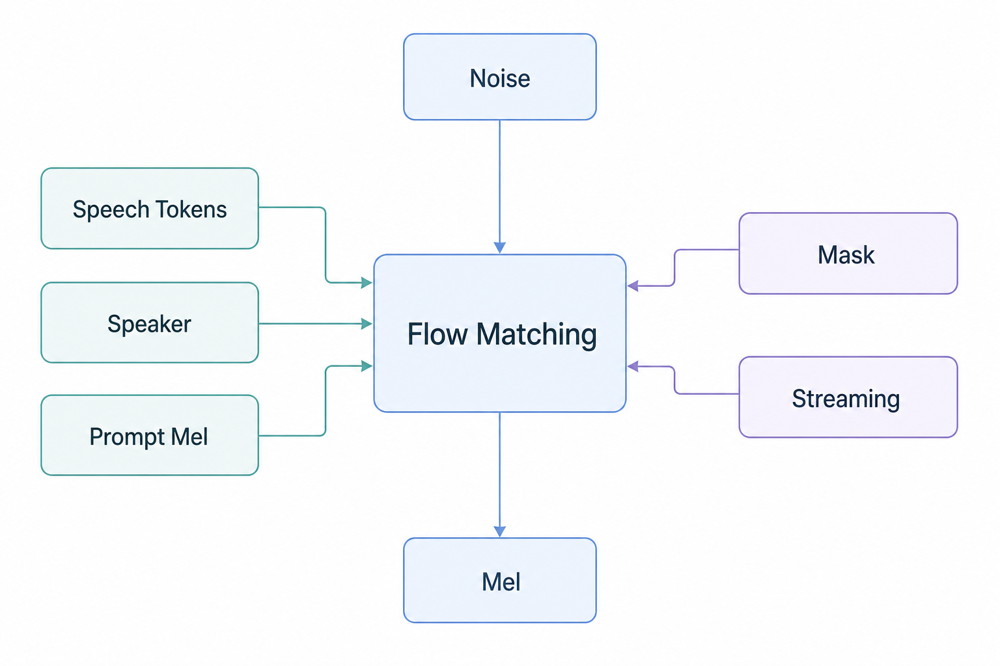
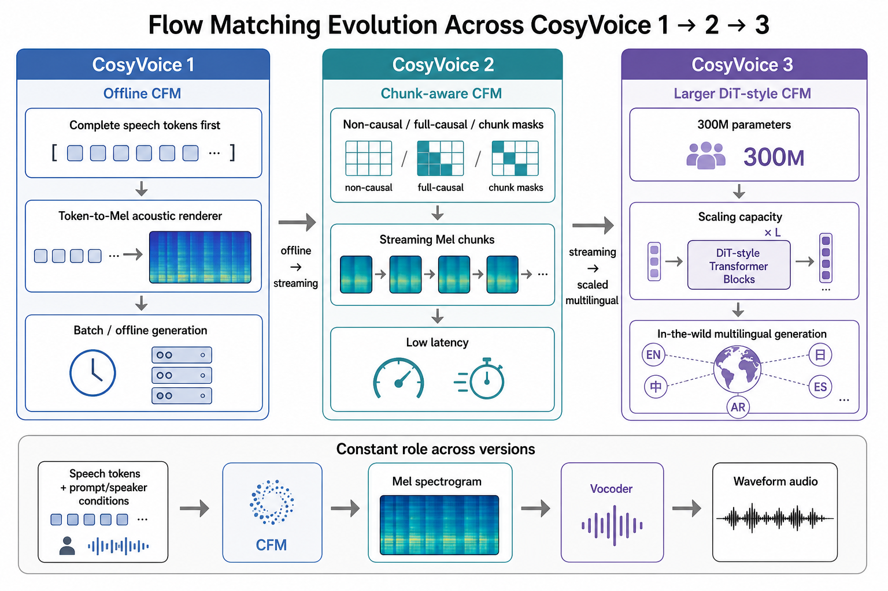
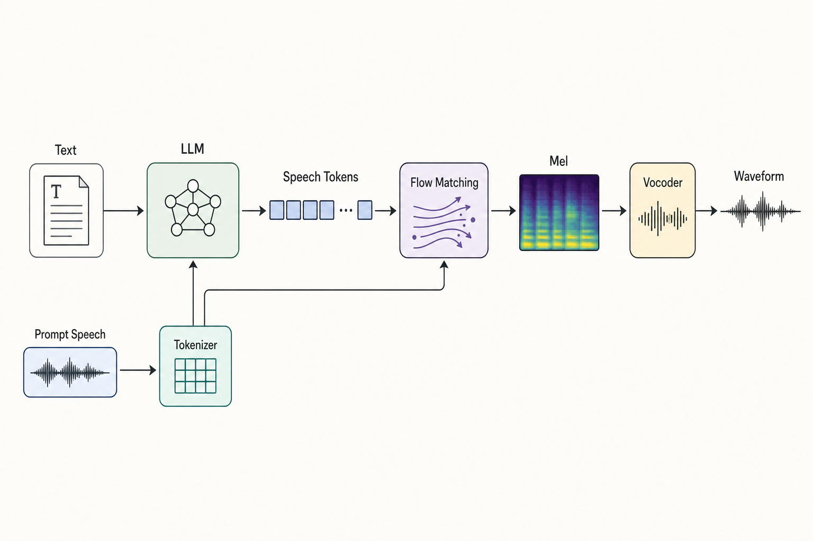

# Flow Matching 专题

[返回 CosyVoice 专题首页](./)

# Flow Matching 专题：从零理解 CosyVoice 的 Token-to-Mel

## 一句话总结

Flow Matching 在 CosyVoice 里不是“理解文本”的模块，而是一个声学渲染器：它接收 LLM 生成的 speech token、参考语音 Mel 和说话人条件，然后学习一条从随机噪声 Mel 走向真实 Mel 的路径，最终把离散 token 渲染成连续 Mel spectrogram，再交给 vocoder 变成波形。

## 你先记住这 5 句话

- LLM 负责“说什么”：根据文本生成 speech token。
- Flow Matching 负责“怎么把 token 变成声音特征”：生成 Mel spectrogram。
- Vocoder 负责“把 Mel 变成可播放音频”：生成 waveform。
- 训练时，Flow Matching 学的是“每个中间状态应该往哪个方向走”，也就是速度场。
- 推理时，它从随机噪声出发，用 Euler 积分走若干步，逐步走到像真实语音的 Mel。

## 生活类比：Flow Matching 像什么

先不要把 Flow Matching 想成复杂公式。你可以把它理解成一种“学会带路”的模型：起点是一团没有意义的噪声，终点是一段真实语音的 Mel 图，模型要学会在任意中间位置判断“下一步应该往哪里走”。

### 类比 1：从陌生城市开车到目的地

想象你在一个陌生城市开车：

- 起点：你随机出现在城市某个位置。
- 终点：你要到达某个具体地址。
- 导航：根据你当前所在位置，告诉你下一小段该往哪个方向开。
- 多走几步：每次按导航走一点点，最终抵达目的地。

对应到 Flow Matching：

- 随机起点就是噪声 Mel，也就是 x0。
- 目的地就是真实 Mel，也就是 x1。
- 当前位置就是中间状态 x_t。
- 导航给出的方向就是速度场 velocity。
- 一步步按方向走，就是推理时的 ODE / Euler 更新。

重点不是“导航一次性把你瞬移到目的地”，而是“它在每个位置都知道你该往哪里走”。Flow Matching 也是这样：它不是简单背答案，而是学习整个路径上的方向感。

### 类比 2：把一团毛线整理成一件毛衣

再换一个更贴近生成的例子：你手里有一团乱毛线，目标是一件毛衣。

- 乱毛线：没有结构，但有材料。
- 毛衣：有稳定形状、纹理和用途。
- 整理过程：每一步都把局部变得更接近最终形状。
- 老师傅：看一眼当前状态，就知道下一步该拉哪根线、收哪里、放哪里。

对应到 CosyVoice：

- 噪声 Mel 像乱毛线。
- 真实语音 Mel 像织好的毛衣。
- speech token 像设计图，告诉模型“这句话大概应该是什么内容和节奏”。
- speaker prompt 像款式要求，告诉模型“要像谁的声音、什么音色”。
- Flow Matching 像老师傅，不断把乱的声学图整理成自然语音的声学图。

这个类比的关键是：speech token 不是最终声音，它更像设计图；Flow Matching 才负责把设计图落成具体声学形状。

### 类比 3：健身教练纠正动作

训练 Flow Matching 时，模型会看到很多“中间动作”：

- 有些动作离标准动作很远。
- 有些动作已经接近标准动作。
- 教练不需要每次都从头讲完整动作，只需要告诉你当前这个姿势应该怎么调整。

对应到训练过程：

- 模型随机拿一个 t，构造一个介于噪声和真实 Mel 之间的 x_t。
- 模型看 x_t、t 和条件信息，预测“此刻该往哪里修正”。
- 训练目标不是让它直接吐出最终 Mel，而是让它预测正确的修正方向。

所以 Flow Matching 学到的是一种“局部纠偏能力”：无论你处在生成路径上的哪个位置，它都能告诉你下一步该怎么变得更像真实语音。

### 用一句生活话总结

Flow Matching 不是“凭空画出一张最终语音图”，而是“训练一个很会带路的向导”：它知道从噪声城市里的任意位置，如何一步步走到真实语音 Mel 这个目的地。

## 图解：Flow Matching 到底在干什么

可以这样读：

- 左边的噪声 Mel：一开始什么都不像，只是随机噪声。
- 右边的真实 Mel：训练数据里真实语音对应的 Mel spectrogram。
- 中间的 x_t：从噪声到真实 Mel 路径上的某个中间状态。
- 神经网络要学的不是“直接生成最终 Mel”，而是在任意中间状态 x_t 上预测一个方向：下一步应该往哪里走。
- 推理时没有真实 Mel，只有噪声、speech token、speaker prompt 等条件；模型靠学到的速度场一步步走到生成 Mel。

## 最小前置知识

### Mel spectrogram 是什么

你可以把 Mel spectrogram 理解成“声音的图片”：

- 横轴是时间。
- 纵轴是频率。
- 颜色强度表示某个时间和频率上的能量。
- TTS 系统通常先生成 Mel，再用 vocoder 把 Mel 还原成 waveform。

在 CosyVoice 里，Flow Matching 生成的目标就是 Mel，而不是直接生成 waveform。

### 为什么需要 Flow Matching

如果只靠 LLM 生成离散 speech token，系统还不知道每一帧声音应该长什么样：

- token 只是一串离散编号。
- Mel 是连续二维特征。
- 参考音色、韵律、停顿、能量变化都要落到 Mel 上。
- Flow Matching 就是 token-to-mel 的声学生成模块。

### Flow Matching 和 Diffusion 的关系

两者都可以从噪声生成数据，但直觉不同：

- Diffusion 常见说法是：先逐步加噪，再学习反向去噪。
- Flow Matching 更像是：直接学习从噪声分布到数据分布的一条连续流动路径。
- 在代码里，你会看到它预测的是速度 / vector field，而不是简单预测“干净图像”或“噪声”。

## 核心机制：从 x0 到 x1

Flow Matching 训练时有两个端点：

- x0：随机噪声。
- x1：真实 Mel。

然后随机采样一个时间 t，构造中间状态 x_t：

~~~text
x_t = (1 - t) * x0 + t * x1
~~~

CosyVoice 代码里考虑 sigma_min，形式是：

~~~text
y = (1 - (1 - sigma_min) * t) * z + t * x1
u = x1 - (1 - sigma_min) * z
~~~

其中：

- z 是噪声。
- x1 是真实 Mel。
- y 是中间状态。
- u 是从中间状态应该前进的目标速度。
- 模型输入 y、t、条件信息，输出 pred。
- loss 让 pred 接近 u。

这就是 Flow Matching 最核心的训练目标：学会在任意中间状态上预测该往真实 Mel 方向走的速度。

## 对应到 CosyVoice 代码

以下代码来自公开仓库 FunAudioLLM/CosyVoice，本次检查的是 2026-05-17 拉取的版本。仓库主分支同时包含 CosyVoice1/2/3 相关模块，具体论文实现细节可能随代码更新变化；下面只引用和 Flow Matching 机制直接相关的稳定结构。

### 训练目标：compute_loss

文件：cosyvoice/flow/flow_matching.py

核心逻辑可以简化成：

~~~python
def compute_loss(x1, mask, mu, spks=None, cond=None, streaming=False):
    # x1: 真实 Mel
    # mu: speech token 条件经过 encoder 后得到的条件表示
    # spks: 说话人 embedding
    # cond: prompt Mel 条件

    b, _, _ = mu.shape

    # 1. 随机采样时间 t
    t = torch.rand([b, 1, 1], device=mu.device, dtype=mu.dtype)

    # 2. 采样噪声 z
    z = torch.randn_like(x1)

    # 3. 构造从噪声到真实 Mel 的中间点 y
    y = (1 - (1 - sigma_min) * t) * z + t * x1

    # 4. 目标速度 u：从当前位置应该往哪里走
    u = x1 - (1 - sigma_min) * z

    # 5. 让 estimator 预测速度
    pred = estimator(y, mask, mu, t.squeeze(), spks, cond, streaming=streaming)

    # 6. 速度预测误差
    loss = mse(pred * mask, u * mask)
    return loss
~~~

初学者重点看这三行：

~~~python
y = (1 - (1 - sigma_min) * t) * z + t * x1
u = x1 - (1 - sigma_min) * z
pred = estimator(y, mask, mu, t.squeeze(), spks, cond, streaming=streaming)
~~~

它们分别对应：

- 造一个中间状态。
- 算出正确方向。
- 训练神经网络预测这个方向。

### 推理过程：从噪声走到 Mel

文件：cosyvoice/flow/flow_matching.py

推理时没有真实 Mel x1，所以只能从噪声 z 出发：

~~~python
z = torch.randn_like(mu) * temperature
t_span = torch.linspace(0, 1, n_timesteps + 1)

for step in range(1, len(t_span)):
    dphi_dt = forward_estimator(x, mask, mu, t, spks, cond, streaming)
    x = x + dt * dphi_dt
    t = t + dt

return x
~~~

这就是 Euler ODE solver。你可以把它理解成：

1. 站在随机噪声点。
2. 问模型：现在应该往哪个方向走？
3. 往那个方向走一小步。
4. 重复 10 步左右。
5. 得到 Mel。

CosyVoice 代码里推理时常见 n_timesteps=10，说明它不是像早期 diffusion 那样需要非常多步采样；这对 TTS 延迟很重要。

## 条件信息：为什么叫 Conditional Flow Matching

CosyVoice 不是无条件生成任意 Mel，而是带条件生成。常见条件包括：

- mu：speech token 经过 encoder / upsampler 后得到的条件表示。
- spks：说话人 embedding，用来保持音色。
- cond：prompt Mel，用来提供参考语音片段。
- mask：告诉模型哪些位置有效，流式时还控制可见范围。
- streaming：是否使用流式 attention mask。

可以把条件关系理解成下面这张窄版流程图。它按 A4/PDF 导出重新排版：左侧是 text-to-token-to-mu 主干，右侧是 prompt Mel、speaker embedding、mask/streaming 的条件汇总，底部再与随机噪声一起进入 CFM。

一句话：Conditional 的意思是“生成路径不是随便走，而是在 token、说话人、prompt Mel 的约束下走”。

## CosyVoice1 -> CosyVoice2 -> CosyVoice3 的 Flow Matching 演进

### 总体演进

| 版本 | Flow Matching 的角色 | 关键变化 | 你需要记住 |
|---|---|---|---|
| CosyVoice 1 | 离线 token-to-mel 声学渲染 | LLM 先生成完整 speech token，CFM 再生成 Mel | 先解决质量和范式 |
| CosyVoice 2 | 支持 streaming 的 chunk-aware CFM | 训练/推理支持 streaming mask、lookahead、chunk 输出 | 解决低延迟 |
| CosyVoice 3 | DiT-based CFM，更大声学模型 | 用 DiT backbone 和更大参数规模提升真实场景生成 | 解决规模和复杂场景 |

## CosyVoice 1：离线 CFM

### 代码路径

文件：cosyvoice/flow/flow.py

核心类：MaskedDiffWithXvec

训练时的链路：

~~~python
token = input_embedding(speech_token)
h, h_lengths = encoder(token, token_len)
h = encoder_proj(h)
h, h_lengths = length_regulator(h, feat_len)

loss, _ = decoder.compute_loss(
    feat.transpose(1, 2),   # 真实 Mel
    mask.unsqueeze(1),
    h.transpose(1, 2),      # token 条件
    embedding,              # speaker embedding
    cond=conds              # prompt Mel 条件
)
~~~

推理时的链路：

~~~python
token = concat(prompt_token, generated_token)
h = encoder(token)
h = length_regulator.inference(...)

conds[:, :mel_len1] = prompt_feat

feat, flow_cache = decoder(
    mu=h,
    mask=mask,
    spks=embedding,
    cond=conds,
    n_timesteps=10,
    prompt_len=mel_len1,
    cache=flow_cache
)

feat = feat[:, :, mel_len1:]
~~~

初学者理解：

- LLM 已经生成了 speech token。
- CFM 把 prompt token + generated token 拼起来看。
- prompt Mel 作为条件固定在前面。
- 最后只取新生成部分的 Mel。
- 这适合离线生成，因为它更依赖完整 token 序列和完整声学上下文。

## CosyVoice 2：流式 chunk-aware CFM

CosyVoice 2 的核心问题是：不能等所有 token 都生成完再出声。

所以它要让 Flow Matching 支持：

- token 来一段，Mel 生成一段。
- 当前 chunk 不能随便看未来。
- 需要少量 lookahead 减少边界断裂。
- chunk 之间要平滑衔接。

### 训练时随机混合 streaming / non-streaming

文件：cosyvoice/flow/flow.py

核心类：CausalMaskedDiffWithXvec

~~~python
streaming = True if random.random() < 0.5 else False

h, h_lengths = encoder(token, token_len, streaming=streaming)

loss, _ = decoder.compute_loss(
    feat.transpose(1, 2),
    mask.unsqueeze(1),
    h.transpose(1, 2),
    embedding,
    cond=conds,
    streaming=streaming,
)
~~~

这说明 CosyVoice 2 不是单独训练一个流式模型，而是在训练时让同一个 Flow 模块见到两种模式：

- 非流式：能看完整上下文，质量更好。
- 流式：只能看有限上下文，延迟更低。

### decoder 里通过 attention mask 控制未来信息

文件：cosyvoice/flow/decoder.py

核心逻辑：

~~~python
if streaming is True:
    attn_mask = add_optional_chunk_mask(
        x, mask_down.bool(),
        False, False,
        0,
        static_chunk_size,
        -1
    )
else:
    attn_mask = add_optional_chunk_mask(
        x, mask_down.bool(),
        False, False,
        0,
        0,
        -1
    ).repeat(1, x.size(1), 1)
~~~

初学者理解：

- 非流式时，模型可以看完整上下文。
- 流式时，attention 被限制在 chunk 范围内。
- 这就是 chunk-aware causal Flow Matching 的工程核心。

### 推理时按 token chunk 输出

文件：cosyvoice/cli/model.py

CosyVoice2Model 里有这样的逻辑：

~~~python
token_hop_len = 25
token_max_hop_len = 4 * token_hop_len
stream_scale_factor = 2

if stream is True:
    token_offset = 0
    while True:
        if generated_tokens_ready:
            this_tts_speech_token = tokens[:token_offset + hop_len + pre_lookahead_len]
            this_tts_speech = token2wav(
                token=this_tts_speech_token,
                stream=True,
                finalize=False,
            )
            token_offset += hop_len
            hop_len = min(token_max_hop_len, hop_len * stream_scale_factor)
            yield audio_chunk
~~~

这里的直觉是：

- 先小 chunk 出第一段音频，降低首包延迟。
- 后面逐渐增大 chunk，提高稳定性和质量。
- pre_lookahead_len 给 Flow 一点未来 token，减少边界问题。

## CosyVoice 3：DiT-based CFM

CosyVoice 3 延续 CosyVoice 2 的流式思路，但声学模型更大，并把 CFM backbone 升级为 DiT-based。

### 代码路径

文件：cosyvoice/flow/flow.py

核心类：CausalMaskedDiffWithDiT

训练时简化逻辑：

~~~python
streaming = True if random.random() < 0.5 else False

token = input_embedding(speech_token)

h = pre_lookahead_layer(token)
h = h.repeat_interleave(token_mel_ratio, dim=1)

loss, _ = decoder.compute_loss(
    feat.transpose(1, 2),
    mask.unsqueeze(1),
    h.transpose(1, 2),
    embedding,
    cond=conds,
    streaming=streaming,
)
~~~

和 CosyVoice 2 相比，你重点看两点：

- 用 pre_lookahead_layer 处理 token 条件。
- 用 repeat_interleave(token_mel_ratio) 把 token 时间分辨率对齐到 Mel 时间分辨率。

### DiT estimator

文件：cosyvoice/flow/DiT/dit.py

核心结构：

~~~python
class DiT(nn.Module):
    def forward(self, x, mask, mu, t, spks=None, cond=None, streaming=False):
        t = time_embed(t)
        x = input_embed(x, cond, mu, spks)

        if streaming is True:
            attn_mask = add_optional_chunk_mask(x, mask.bool(), ..., static_chunk_size, -1)
        else:
            attn_mask = add_optional_chunk_mask(x, mask.bool(), ..., 0, -1)

        for block in transformer_blocks:
            x = block(x, t, mask=attn_mask.bool(), rope=rope)

        output = proj_out(x)
        return output
~~~

初学者理解：

- UNet 更像多尺度卷积/局部结构。
- DiT 把 diffusion / flow 里的 denoiser / velocity estimator 换成 Transformer。
- 对大规模、多语种、复杂韵律和长上下文建模，Transformer backbone 更容易扩容。
- 论文说 CosyVoice 3 把 CFM 从 100M 扩到 300M，并采用 DiT backbone；具体所有工程超参数，论文未逐项明确说明。

## 一个极简玩具代码：Flow Matching 学 1D 分布

下面这个例子不是 CosyVoice 代码，只是帮助你理解“学速度场”这件事。

~~~python
import torch
import torch.nn as nn
import torch.nn.functional as F

class TinyVelocityNet(nn.Module):
    def __init__(self):
        super().__init__()
        self.net = nn.Sequential(
            nn.Linear(2, 64),
            nn.SiLU(),
            nn.Linear(64, 64),
            nn.SiLU(),
            nn.Linear(64, 1),
        )

    def forward(self, x_t, t):
        inp = torch.cat([x_t, t], dim=-1)
        return self.net(inp)

model = TinyVelocityNet()
opt = torch.optim.Adam(model.parameters(), lr=1e-3)

for step in range(10_000):
    # 真实数据 x1：假设来自均值为 3 的分布
    x1 = torch.randn(256, 1) * 0.5 + 3.0

    # 噪声 x0：标准正态
    x0 = torch.randn_like(x1)

    # 随机时间 t
    t = torch.rand(256, 1)

    # 中间状态
    x_t = (1 - t) * x0 + t * x1

    # 目标速度：从 x0 指向 x1
    target_velocity = x1 - x0

    # 模型预测速度
    pred_velocity = model(x_t, t)

    loss = F.mse_loss(pred_velocity, target_velocity)
    opt.zero_grad()
    loss.backward()
    opt.step()
~~~

训练完成后，推理就是：

~~~python
x = torch.randn(1, 1)  # 从噪声出发
n_steps = 20

for i in range(n_steps):
    t = torch.full((1, 1), i / n_steps)
    v = model(x, t)
    x = x + v / n_steps

print(x)  # 应该逐渐接近真实数据分布
~~~

把这个 1D 例子替换成 CosyVoice：

| 玩具例子 | CosyVoice |
|---|---|
| 1D 数字 x | 80 维 Mel 序列 |
| x0 随机噪声 | 随机 Mel 噪声 |
| x1 真实样本 | 真实语音 Mel |
| t 时间 | flow / diffusion timestep |
| velocity net | UNet 或 DiT estimator |
| 条件为空 | speech token、speaker embedding、prompt Mel |
| Euler 20 步 | CosyVoice 常见 10 步 |

## Flow Matching 在 TTS 中的工程价值

### 1. 把语义和声学分工

CosyVoice 的设计不是一个模型从文本直接吐 waveform，而是分层：

好处是：

- LLM 专心处理内容和高层序列。
- CFM 专心处理连续声学细节。
- Vocoder 专心还原波形。
- 每个模块可以独立优化。

### 2. 采样步数较少

Flow Matching 用 ODE 速度场生成，CosyVoice 推理里常见 n_timesteps=10。步数少意味着：

- 延迟更低。
- 更容易做流式。
- 更适合语音助手这类实时场景。

### 3. 容易加条件

CFM 可以自然接收多种条件：

- token 条件控制内容。
- prompt Mel 控制参考语音上下文。
- speaker embedding 控制音色。
- streaming mask 控制可见范围。
- DiT backbone 扩展容量。

## 常见误区

### 误区 1：Flow Matching 负责理解文本

不对。文本理解和 token 生成主要在 LLM 侧。Flow Matching 负责把 token 渲染成 Mel。

### 误区 2：Flow Matching 和 vocoder 是一回事

不对。Flow Matching 输出 Mel；vocoder 输入 Mel，输出 waveform。

### 误区 3：Flow Matching 一定是非流式的

不对。CosyVoice 2 通过 chunk-aware attention mask 和 pre-lookahead 支持流式 CFM。

### 误区 4：CosyVoice 3 的 DiffRO 直接优化 Flow Matching

不准确。CosyVoice 3 的 DiffRO 主要在 speech token logits 层做可微 reward optimization；CFM/vocoder 是后面的渲染链路，不是 DiffRO 直接优化的核心对象。

### 误区 5：DiT 就等于 Flow Matching

不对。Flow Matching 是训练/生成范式；DiT 是速度场 estimator 的一种网络 backbone。CosyVoice 3 是 DiT-based CFM。

## prerequisite / related / confusing_with

### prerequisite

- [CosyVoice 系列前置知识](prerequisites.md)
- [Speech Tokenizer](prerequisites.md)
- [Autoregressive Language Model](prerequisites.md)
- [Neural Vocoder](prerequisites.md)
- [Streaming TTS](prerequisites.md)

### related

- [CosyVoice 1 - 监督语义 Token 的可扩展零样本 TTS](cosyvoice-1.md)
- [CosyVoice 2 - 可流式的大语言模型 TTS](cosyvoice-2.md)
- [CosyVoice 3 - 面向真实场景的多语种语音生成](cosyvoice-3.md)
- [Diffusion Transformer](prerequisites.md)
- [Chunked Attention](prerequisites.md)

### confusing_with

- Flow Matching vs Diffusion：都能从噪声生成数据；Flow Matching 更强调学习连续路径上的速度场。
- CFM vs Vocoder：CFM 生成 Mel，vocoder 生成 waveform。
- UNet vs DiT：二者都是 estimator backbone，不是训练目标本身。
- Streaming LM vs Streaming CFM：LM 决定 speech token 何时出来；CFM 决定 Mel/audio chunk 何时出来。

## 我需要重点掌握的知识点

- Flow Matching 的核心是“预测速度场”，不是直接预测最终 Mel。
- CosyVoice 中的 CFM 是 token-to-mel 模块，位于 LLM 和 vocoder 中间。
- 训练时用真实 Mel 和噪声构造中间点；推理时从噪声开始用 Euler 积分走到 Mel。
- CosyVoice 2 的关键是让 CFM 支持 chunk-aware streaming。
- CosyVoice 3 的关键是把 CFM backbone 扩成 DiT-based 更大声学模型。
- 看代码时优先抓三处：compute_loss、solve_euler、flow.inference/token2wav。

## 建议复习路径

1. 先反复看第一张图，记住 x0 / x_t / x1 / velocity / Euler。
2. 再看 compute_loss 代码，只掌握三行：构造 y、构造 u、预测 pred。
3. 再看 CosyVoice 1 的离线 token-to-mel，建立完整链路。
4. 再看 CosyVoice 2 的 streaming mask 和 token chunk。
5. 最后看 CosyVoice 3 的 DiT，把它理解成“更强的速度场预测器”。
