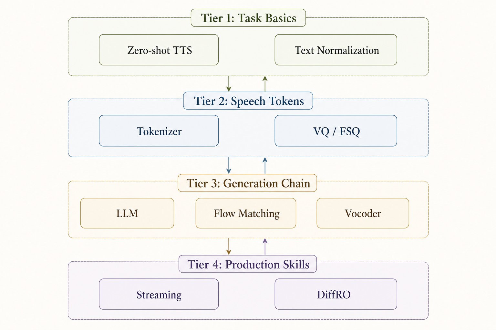
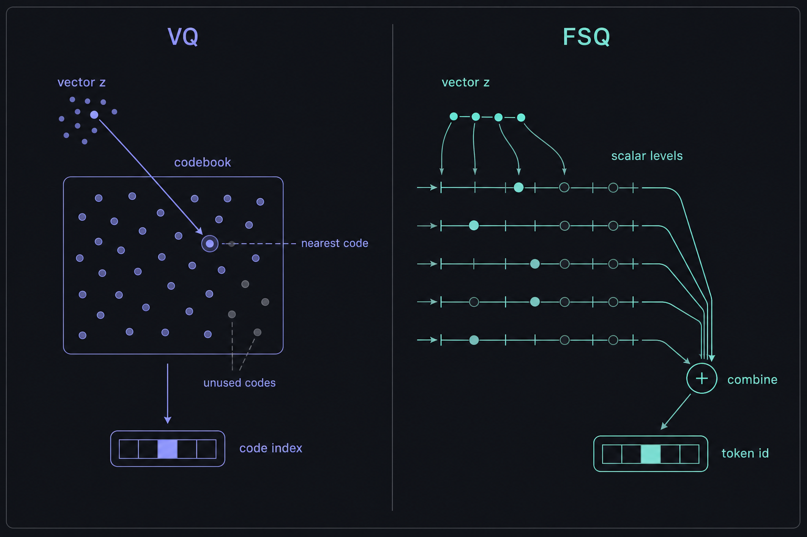
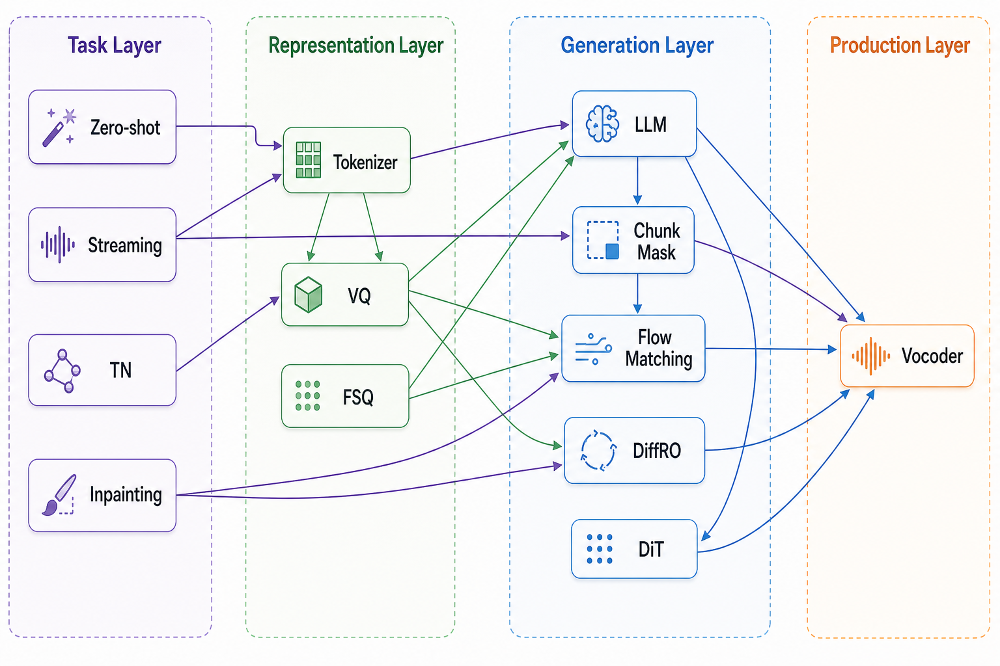

# CosyVoice 系列前置知识

[返回 CosyVoice 专题首页](./)

# CosyVoice 系列前置知识

## 一句话总结

理解 CosyVoice 系列，需要先掌握“文本如何变成离散语音 token、LLM 如何预测这些 token、Flow Matching 如何把 token 渲染成 Mel、Vocoder 如何把 Mel 还原成 waveform”，再理解流式、后训练、多语种和发音控制这些工程扩展。

## 图解

- 这张图把 prerequisite 分成四组：表示层、生成层、流式层、后训练层。
- 推荐先学左上和右上两组，再进入 CosyVoice 2 的流式机制和 CosyVoice 3 的 DiffRO / TN / 发音控制。
- 这张图由 gpt-image-2 生成，作为前置概念的总览入口；精确概念定义以正文描述为准。

## 学习顺序

- 第一层：先懂 TTS 任务本身，包括 zero-shot、speaker cloning、内容一致性和说话人相似度。
- 第二层：再懂中间表示，也就是 speech tokenizer、VQ、FSQ。
- 第三层：再懂生成链路，即 LLM 生成离散 token，Flow Matching 生成连续 Mel，vocoder 生成 waveform。
- 第四层：最后补生产问题，包括流式、文本规范化、纠音、后训练和多语种评测。

## 1. Zero-shot TTS

### 需要掌握什么

- Zero-shot TTS 是指模型不为目标说话人单独训练，只用一小段参考语音，就生成该说话人风格或音色的语音。
- 输入通常包含：
  - 目标文本：要说什么。
  - 参考语音：目标说话人的音色、韵律、风格提示。
  - 可选指令：情绪、口音、说话风格、副语言标签。
- 输出需要同时满足：
  - 内容正确：CER / WER 低。
  - 音色相似：speaker similarity 高。
  - 自然度高：MOS / NMOS 高。
  - 风格一致：情绪、语速、停顿、强调合理。

### 为什么对 CosyVoice 重要

- CosyVoice 的目标不是普通单说话人 TTS，而是可扩展的零样本、多语种、可控语音生成。
- 系列里的 tokenizer、LLM、CFM、speaker prompt 都是在解决同一个问题：如何把“说什么”和“像谁说、怎么说”拆开建模。

### 对应论文位置

- [CosyVoice 1 - 监督语义 Token 的可扩展零样本 TTS](cosyvoice-1.md)：建立 zero-shot TTS 基础范式。
- [CosyVoice 2 - 可流式的大语言模型 TTS](cosyvoice-2.md)：把 zero-shot TTS 做成低延迟流式系统。
- [CosyVoice 3 - 面向真实场景的多语种语音生成](cosyvoice-3.md)：扩展到真实多语种和长尾场景。

## 2. Speech Tokenizer

### 需要掌握什么

- Speech tokenizer 把连续语音压缩成离散 token 序列。
- 它相当于给语音建立一种“中间语言”，让 LLM 可以像生成文本 token 一样生成 speech token。
- tokenizer 的质量决定：
  - token 是否保留文本语义。
  - token 是否泄漏过多说话人信息。
  - token rate 是否适合低延迟生成。
  - codebook 是否被充分利用。

### 两类常见 token

- Acoustic codec token：
  - 目标偏重音频重建。
  - 更关心波形或声学细节。
  - 可能保留大量音色和声学信息，但与文本语义对齐不一定强。
- Supervised semantic token：
  - 由 ASR、LID、SER 等监督任务约束。
  - 更关心语义、语言、情绪等可识别信息。
  - 更适合作为 text-to-speech LM 的目标。

### 为什么对 CosyVoice 重要

- CosyVoice 1 的关键判断是：TTS 的中间 token 不能只追求声学重建，还要和文本语义强对齐。
- CosyVoice 2 把 tokenizer 从 VQ 改成 FSQ，重点解决 codebook 利用率和内容一致性。
- CosyVoice 3 用 MinMo 多任务 tokenizer，让 token 同时吸收 ASR、语言识别、情绪识别、音频事件、说话人分析等监督信号。

## 3. Vector Quantization

### 需要掌握什么

- Vector Quantization，简称 VQ，是把连续向量映射到有限 codebook 中最近的离散向量。
- 简化理解：
  - encoder 输出连续向量。
  - 在 codebook 中找最近的 code。
  - 用 code index 表示这段语音。
- 它的优势是简单、直观，适合把连续语音变成离散 token。

### 关键风险

- Codebook collapse：很多 code 长期不用，实际容量变小。
- 语义和声学目标冲突：如果训练目标偏重重建，token 可能不够语义化。
- 信息分配不清：token 可能同时混入内容、韵律、音色，使下游 LLM 学习更困难。

### 对应到 CosyVoice

- CosyVoice 1 在 ASR encoder 中插入 VQ，得到 S3 token。
- 这种设计让 token 保留 ASR 语义能力，因此比纯无监督 codec token 更适合内容一致性。

## 4. Finite Scalar Quantization

### 需要掌握什么

- FSQ 不像 VQ 那样从向量 codebook 中找最近邻，而是把向量的多个标量维度分别量化到有限等级，再组合成离散 code。
- 直观理解：
  - VQ 是“从一本词典里选一个最像的词”。
  - FSQ 是“多个离散属性组合成一个词”。
- FSQ 往往能提高 codebook 利用率，减少大量 code 闲置的问题。

### 机制拆解

FSQ 的核心思想是：不要维护一个“需要训练的向量词典”，而是直接把连续表示拆成若干个有限标量等级。

假设 tokenizer encoder 输出一个 4 维向量：

    z = [0.73, -0.12, 1.41, 0.08]

如果每个维度允许落到 4 个等级，例如 {-1, 0, 1, 2}，那么 FSQ 会分别处理每一维：

    0.73  -> 1
    -0.12 -> 0
    1.41  -> 1 或 2，取决于具体缩放和舍入规则
    0.08  -> 0

最后得到一个离散组合，例如：

    FSQ code = [1, 0, 2, 0]

这个组合可以再被映射成一个 token id，交给后面的 LLM 预测。关键点是：FSQ 的 code 空间来自“多个标量等级的笛卡尔积”，而不是来自一张显式学习出来的 codebook。

更一般地说，如果有 d 个标量维度，每个维度分别有 L_1, L_2, ..., L_d 个等级，那么理论 code 数量是：

    总 code 数 = L_1 x L_2 x ... x L_d

这就是 FSQ 的“组合式容量”。它不是提前训练出 N 个向量让模型去抢，而是让每个维度各自表达一部分信息，再组合成完整 token。

### VQ 和 FSQ 的关键差异

下面这张 GPT 图把 VQ 的“向量词典最近邻”和 FSQ 的“标量等级组合”放在一起对照，先建立直觉，再看后面的表格。

#### VQ：从向量词典里找最近项

#### FSQ：把多个标量等级组合成 code

见上图右侧：FSQ 不维护可学习向量词典，而是把多个标量维度分别量化后组合成 token id。

| 维度 | VQ | FSQ |
|---|---|---|
| 基本操作 | 向量最近邻查找 | 标量逐维分级 |
| codebook 来源 | 可学习向量表 | 多个有限标量等级组合 |
| 训练稳定性 | 容易受 codebook 更新、使用频率影响 | 不依赖学习整张向量 codebook，通常更稳定 |
| code 利用率 | 可能出现大量死码 | 组合式空间通常更容易被覆盖 |
| 计算方式 | 需要比较向量距离 | 主要是缩放、限幅、舍入或离散化 |
| 对下游 LLM | token 分布可能更不均衡 | token 覆盖更均匀时，序列建模更容易 |

### 为什么 FSQ 相对 VQ 有优势

- **减少 codebook collapse**：VQ 里的 code 是“被竞争选择”的，如果一些 code 初期很少被选中，后面可能越来越难被训练到；FSQ 没有同样形式的可学习向量 codebook，因此天然缓解死码问题。
- **提高有效容量**：VQ 的名义 codebook 大小不等于实际容量，如果 4096 个 code 只有一部分常用，真实表达能力会缩水；FSQ 的组合式 code 更容易让不同维度共同参与表达。
- **训练路径更直接**：VQ 要处理最近邻选择、codebook 更新、commitment loss 或类似稳定化机制；FSQ 的离散化更像确定性分箱，工程上更简单。
- **token 分布更友好**：TTS 的 text-to-token LM 需要学习 speech token 序列。如果 tokenizer 输出高度偏斜，LLM 会反复看到少数 token，长尾 token 学不好；FSQ 改善利用率后，通常能让 token 分布更健康。
- **内容一致性更强**：CosyVoice 2 的消融结果显示，使用 FSQ 后内容错误率下降，说明 tokenizer 的离散表示质量会直接影响最终读错字、漏字、替换字的问题。

### 为什么这会影响 TTS 内容一致性

在 CosyVoice 这种两阶段架构里，LLM 预测的是 speech token，不是最终音频。如果 speech tokenizer 本身表达不稳定，就会出现两个问题：

1. 同一句话在 tokenizer 空间里对应的 token 不够稳定，LLM 更难学到文本到 speech token 的映射。
2. 某些 code 很少被使用，LLM 对这些 token 的概率估计更差，生成时更容易出现局部内容漂移。

FSQ 的价值不是让声音“直接更好听”，而是让离散中间表示更稳定、更可用。它改善的是上游语义 token 的质量，进而让后面的 LLM 更容易预测正确内容。

### 对应到 CosyVoice 2

CosyVoice 2 把 CosyVoice 1 的 VQ tokenizer 替换成 FSQ tokenizer。论文中的关键实验证据是：

- test-zh CER 从 2.56 降到 1.45。
- test-en WER 从 3.81 降到 2.57。
- 这些结果来自模块消融，说明 FSQ 对内容一致性有直接贡献。

这也解释了为什么 CosyVoice 2 的 tokenizer 升级不是一个边缘改动：它改变了 LLM 要学习的离散语音空间。

### 边界和注意事项

- FSQ 不是无条件优于 VQ。它的效果仍取决于 encoder 质量、监督任务、标量维度数、每个维度的等级数、token rate 和下游 LM 容量。
- 如果等级数太少，FSQ 可能压缩过度，丢失语音内容或韵律细节。
- 如果等级数太多，token 空间会变大，下游 LLM 的学习压力会上升。
- CosyVoice 2 论文强调 FSQ 提升 codebook utilization 和内容一致性，但具体每个标量维度的等级配置、缩放细节和完整实现超参数，论文未明确说明。

### 为什么对 CosyVoice 重要

- CosyVoice 2 的实验证明，FSQ 对内容一致性有明显帮助。
- 这说明 tokenizer 不是前处理小模块，而是 TTS 质量的核心瓶颈之一。
- 从系列演进看，CosyVoice 1 先证明“监督语义 token”比纯声学 token 更适合 TTS；CosyVoice 2 进一步证明“更稳定、更高利用率的离散化方式”也会影响最终可懂度。

### 容易混淆

- FSQ 不是 vocoder，也不是 Flow Matching。
- FSQ 只负责把语音编码成离散 token；后面仍需要 LLM 预测 token、CFM 生成 Mel、vocoder 还原波形。
- FSQ 也不是把音频压缩成可播放波形的 codec；在 CosyVoice 里，它更像是给 LLM 使用的语义 token 生成器。

## 5. ASR Encoder

### 需要掌握什么

- ASR encoder 是语音识别模型中负责把音频编码成高层语义表示的模块。
- 它通常学到：
  - 音素、字词、语言内容。
  - 部分韵律和语音边界。
  - 对噪声和说话人差异更鲁棒的表示。

### 为什么对 CosyVoice 重要

- CosyVoice 1 的 S3 tokenizer 来自监督 ASR encoder。
- 这样得到的 speech token 天然更接近“语音中的文本内容”，比纯声学 token 更适合让 LLM 学习 text-to-token 映射。
- CosyVoice 3 进一步把监督信号扩展到 ASR、LID、SER、AED、SA，说明 tokenizer 的监督任务越丰富，token 可承载的信息也越适合真实场景。

## 6. Autoregressive Language Model

### 需要掌握什么

- 自回归语言模型按顺序预测下一个 token。
- 在文本 LLM 中，它预测下一个文本 token。
- 在 CosyVoice 中，它预测下一个 speech token。

### 对 CosyVoice 的角色

- LLM 不直接生成 waveform。
- 它主要负责：
  - 根据文本生成语义 speech token。
  - 根据 prompt speech token 学习参考语音的韵律和上下文模式。
  - 在 instruction TTS 中吸收风格、情绪、角色等条件。
- CosyVoice 2 开始直接复用 Qwen2.5-0.5B 这类预训练文本 LLM backbone，说明 TTS 可以被组织成一种跨模态 token 序列建模问题。

### 容易混淆

- LLM 不是声学渲染器。
- 如果 speech token 已经生成正确，但 CFM 或 vocoder 不好，最终语音仍可能不自然。
- 如果 LLM 生成 token 错误，CFM 通常只能忠实渲染错误内容，无法从根上纠正文本错误。

## 7. Conditional Flow Matching

### 需要掌握什么

- Flow Matching 是一种连续生成建模方法，学习从噪声分布到数据分布的变换路径。
- Conditional Flow Matching 表示这个变换过程带条件，例如 speech token、speaker prompt、masked Mel。
- 在 CosyVoice 中，它的目标通常是生成 Mel spectrogram，而不是直接生成 waveform。
- 如果完全没有基础，先读专题入口：[Flow Matching 专题 - 从零理解 CosyVoice 的 Token-to-Mel](flow-matching.md)。这篇已经补充生活类比，可以先用“导航带路”“乱毛线织成毛衣”“健身教练纠动作”三个例子建立直觉，再回来看 x0 / x_t / x1 / velocity。

### 为什么对 CosyVoice 重要

- CosyVoice 把任务拆成两段：
  - LLM：生成离散语义 token。
  - CFM：把离散 token 渲染成连续声学特征。
- 这样可以让 LLM 专注内容和高层序列，让 CFM 专注自然度、声学细节和音色融合。

### CosyVoice 中的演进

- CosyVoice 1：OT Conditional Flow Matching，负责 token-to-mel。
- CosyVoice 2：Chunk-aware causal Flow Matching，支持流式渲染。
- CosyVoice 3：DiT-based CFM，扩大声学生成模型容量。

## 8. Neural Vocoder

### 需要掌握什么

- Neural vocoder 把 Mel spectrogram 转成 waveform。
- 它不是决定文本内容的模块，而是决定最终音频听起来是否清晰、自然、实时。
- 常见 vocoder 包括 HiFi-GAN、WaveNet 系列、BigVGAN 等。

### 对 CosyVoice 的角色

- CosyVoice 1 明确使用 HiFi-GAN。
- CosyVoice 2 和 3 论文中对 vocoder 细节没有展开到核心创新层面，具体架构应标注为“论文未明确说明”。
- 生产系统中，vocoder 会影响：
  - 实时率。
  - 高频细节。
  - 噪声和伪影。
  - 端侧部署成本。

## 9. Streaming TTS

### 需要掌握什么

- Streaming TTS 是边接收或处理文本、边生成音频，而不是等完整句子全部处理完再出音。
- 关键指标是：
  - 首包延迟：多久开始出第一段音频。
  - 稳态延迟：持续生成时每个 chunk 的延迟。
  - 质量损失：流式相对离线合成是否退化。

### 为什么难

- LLM 需要逐步生成 speech token。
- CFM 也必须能只看局部上下文生成 Mel。
- Vocoder 要能按 chunk 输出可播放波形。
- 文本切分、停顿、韵律预测都可能因为看不到未来上下文而变差。

### 对 CosyVoice 的角色

- CosyVoice 2 的核心升级就是 streaming。
- 它不仅让 LM 流式生成 token，还设计了 chunk-aware CFM，用 attention mask 控制未来信息可见范围。
- 这使同一套系统能在 offline 和 streaming 模式间切换。

## 10. Chunked Attention

### 需要掌握什么

- Chunked attention 是限制模型注意力可见范围的一种方法。
- 在流式生成中，模型不能随意看完整未来信息，只能看当前 chunk 或有限上下文。
- 常见 mask：
  - Non-causal：可以看完整上下文，质量通常最好，但不适合流式。
  - Full-causal：只能看历史，流式友好，但质量可能下降。
  - Chunk mask：在有限 chunk 内看局部上下文，在延迟和质量间折中。

### 对 CosyVoice 的角色

- CosyVoice 2 的 chunk-aware CFM 用不同 attention mask 复用同一个 CFM。
- 这给工程部署提供一个旋钮：需要低延迟就更 causal，需要更高质量就放宽上下文。

## 11. MinMo

### 需要掌握什么

- MinMo 是 CosyVoice 3 中用于派生 speech tokenizer 的大型音频理解模型。
- 论文中的 tokenizer 不只是 ASR tokenizer，而是通过多任务监督学习得到更丰富的 speech token。
- 涉及任务包括：
  - ASR：语音识别。
  - LID：语言识别。
  - SER：情绪识别。
  - AED：音频事件检测。
  - SA：说话人分析。

### 为什么对 CosyVoice 重要

- CosyVoice 3 面向 in-the-wild 场景，单纯语义 token 不够。
- 真实语音还包含语言、情绪、口音、说话人、环境和副语言信息。
- 多任务 tokenizer 的目标是让 speech token 更适合复杂场景，而不只是标准朗读。

## 12. Differentiable Reward Optimization

### 需要掌握什么

- DiffRO 是 CosyVoice 3 提出的 token-level 后训练方法。
- 核心思路：
  - 不在完整音频上做昂贵的采样和偏好优化。
  - 而是在 speech token logits 上通过可微采样和 reward model 直接优化。
  - 用 KL 约束防止模型偏离 reference model 太远。

### 为什么对 CosyVoice 重要

- TTS 的完整链路是 LLM -> CFM -> vocoder，如果每次 reward 都要生成完整音频，成本高且不稳定。
- DiffRO 把优化位置提前到 speech token 层，绕过大量声学采样成本。
- 它特别适合优化内容一致性，因为 Token2Text reward 可以直接评估 token 是否对应正确文本。

### 风险

- Reward hacking：某个 reward 变好，但音色、情绪、自然度变差。
- Reward model 偏置：ASR-like reward 可能偏好标准发音，不一定公平评价表达性语音。
- 多目标冲突：CER/WER、speaker similarity、emotion accuracy、MOS 可能互相拉扯。

## 13. Gumbel-Softmax

### 需要掌握什么

- Gumbel-Softmax 是一种让离散采样近似可微的方法。
- 普通 argmax 或 categorical sampling 不可微，无法把 reward 梯度传回 logits。
- Gumbel-Softmax 用连续近似来模拟离散 token 选择，使训练时可以反向传播。

### 对 CosyVoice 的角色

- DiffRO 需要对 speech token 做可微优化。
- Gumbel-Softmax 是其中关键技术之一，用来连接“离散 speech token”和“梯度优化”。

## 14. Text Normalization

### 需要掌握什么

- Text Normalization，简称 TN，是把原始文本改写成适合朗读的形式。
- 例子：
  - “2026年5月17日” -> “二零二六年五月十七日”，具体取决于系统规范。
  - “$12.5” -> “十二点五美元”。
  - “OpenAI 4o” -> 需要按场景决定读法。

### 为什么对 TTS 重要

- TTS 输入不是普通文本理解问题，而是“如何读出来”的问题。
- 数字、单位、缩写、人名、地名、混合语言、特殊符号都会造成发音歧义。

### 对 CosyVoice 的角色

- CosyVoice 3 用 self-training 扩展 raw text / normalized text / inverse-normalized text 数据。
- 这说明真实生产 TTS 不能只依赖规则 TN，也需要数据驱动增强。

## 15. Pronunciation Inpainting

### 需要掌握什么

- Pronunciation inpainting 是局部修复或指定发音的方法。
- 它允许系统在局部词语处使用 phoneme 或人工指定读音，而不是完全依赖模型自动推断。

### 为什么对 CosyVoice 重要

- 真实 TTS 中，人名、品牌名、地名、多音字、外语词很容易读错。
- 单纯扩大模型和数据不能保证所有长尾读音都正确。
- CosyVoice 3 的 pronunciation inpainting 提供了生产上可控的纠音入口。

### 和 Text Normalization 的区别

- TN 解决“原始文本该怎么展开成可读文本”。
- Pronunciation inpainting 解决“某个局部词到底该怎么发音”。
- 前者偏文本规范化，后者偏发音控制。

## 16. Diffusion Transformer

### 需要掌握什么

- Diffusion Transformer，简称 DiT，是把 Transformer 用作扩散或 flow 类生成模型 backbone 的架构思路。
- 它适合处理长序列和条件生成，比传统 U-Net 类结构在某些大规模生成任务上更容易扩展。

### 对 CosyVoice 的角色

- CosyVoice 3 使用 DiT-based CFM。
- 这表示声学生成模块也在做 scaling，不只是 text-to-speech LM 扩大。

## 17. Qwen

### 需要掌握什么

- Qwen 是通义千问系列大语言模型。
- 在 CosyVoice 2 中，Qwen2.5-0.5B 被用作 text-speech LM 的初始化 backbone。

### 为什么对 CosyVoice 重要

- 使用预训练文本 LLM 可以继承语言建模能力。
- 但 TTS 仍需要重新组织输入输出，让模型从文本 token 过渡到 speech token。
- CosyVoice 2 移除 text encoder 和 LM 侧 speaker embedding，部分原因就是让架构更适合直接接入预训练 LLM。

## 总体关系图

## 对照 CosyVoice 三篇论文

| 前置知识 | CosyVoice 1 | CosyVoice 2 | CosyVoice 3 |
|---|---|---|---|
| Zero-shot TTS | 核心任务 | 保留并流式化 | 扩展到多语种和真实场景 |
| Speech Tokenizer | S3 supervised token | FSQ supervised token | FSQ-MinMo 多任务 token |
| VQ / FSQ | VQ | FSQ | FSQ |
| ASR Encoder | tokenizer 来源 | SenseVoice-large tokenizer | MinMo 多任务 tokenizer |
| Autoregressive LM | text-to-token | Qwen2.5 初始化 unified LM | 0.5B / 1.5B LM scaling |
| Conditional Flow Matching | OT-CFM token-to-mel | chunk-aware causal CFM | DiT-based CFM |
| Vocoder | HiFi-GAN | 论文未明确说明 | 论文未明确说明 |
| Streaming TTS | 未系统解决 | 核心贡献 | 延续架构，延迟细节较少 |
| DiffRO / Gumbel-Softmax | 无 | 有 RL/DPO 探索 | 核心后训练方法 |
| Text Normalization | 不是重点 | 不是重点 | self-training 增强 |
| Pronunciation Inpainting | 无 | 无 | 核心长尾纠音能力 |

## 复习重点

- 最先掌握：[Speech Tokenizer](prerequisites.md)、[Conditional Flow Matching](flow-matching.md)、[Zero-shot TTS](prerequisites.md)。
- 第二优先级：[Finite Scalar Quantization](prerequisites.md)、[Streaming TTS](prerequisites.md)、[Chunked Attention](prerequisites.md)。
- 第三优先级：[Differentiable Reward Optimization](prerequisites.md)、[Gumbel-Softmax](prerequisites.md)、[Text Normalization](prerequisites.md)、[Pronunciation Inpainting](prerequisites.md)。
- 如果只为读懂论文主线，先记住一句话：CosyVoice 系列是“监督语义 token + LLM 离散生成 + Flow Matching 声学渲染 + Vocoder 波形还原”的持续演进。
