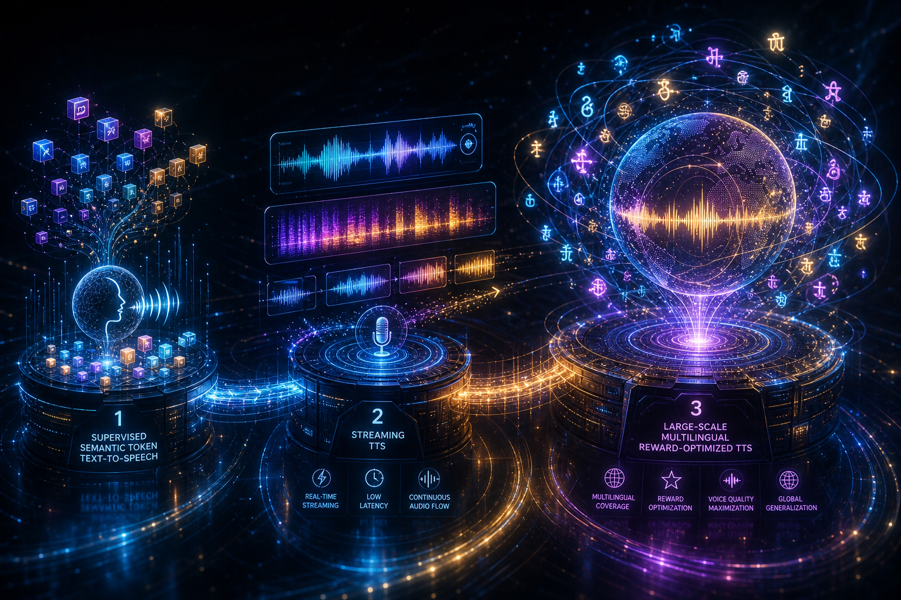
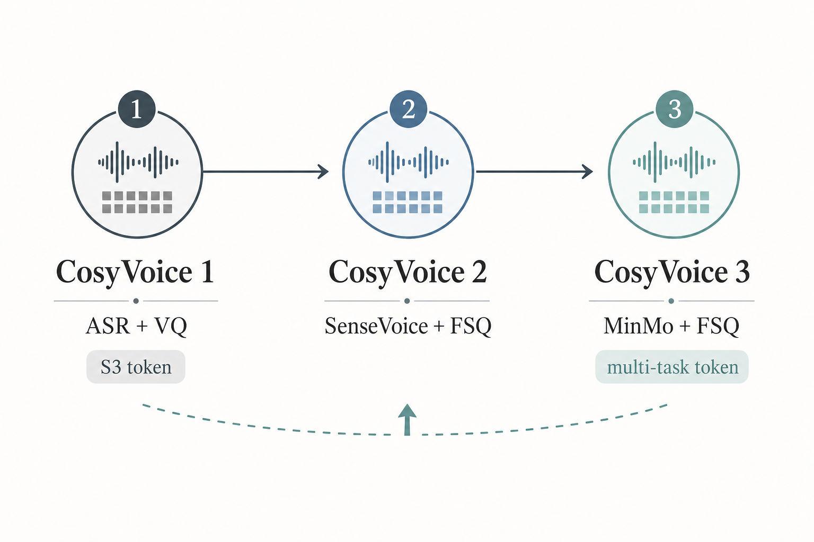

# CosyVoice 系列知识地图

## 核心结论

CosyVoice 系列的演进主线是：先用监督语义 speech token 建立高质量零样本 TTS 骨架，再把系统流式化和 LLM 化，最后通过多任务 tokenizer、数据/模型 scaling 和 token-level post-training 推向真实多语种场景。

## 图解总览

- 这张图用三阶段演进帮助建立全局框架：CosyVoice 1 解决语义 token，CosyVoice 2 解决流式低延迟，CosyVoice 3 解决真实多语种和后训练。
- 读三篇论文时可以把所有细节都挂到这条主线上。
- 这张流程图由 gpt-image-2 生成，用于快速建立直觉；精确结构关系以正文描述为准。

## 系列演进路线

- CosyVoice 1：监督语义 S3 token、LLM text-to-token、CFM token-to-mel，是零样本与指令控制起点。
- CosyVoice 2：FSQ tokenizer、预训练文本 LLM backbone、统一 streaming / non-streaming、chunk-aware causal Flow Matching。
- CosyVoice 3：MinMo 多任务 tokenizer、DiffRO token-level 后训练、百万小时多语种数据、1.5B LM + 300M DiT-CFM、CV3-Eval。

## 各版本解决的问题

| 版本 | 主要问题 | 关键方案 | 主要收益 | 仍未解决 |
|---|---|---|---|---|
| [CosyVoice 1 - 监督语义 Token 的可扩展零样本 TTS](cosyvoice-1.md) | 无监督 speech token 与文本语义对齐不足 | ASR encoder + VQ 得到 S3 token；LLM + CFM 两阶段 | 内容一致性、speaker similarity、可扩展性 | 非流式；架构较复杂；语言覆盖有限 |
| [CosyVoice 2 - 可流式的大语言模型 TTS](cosyvoice-2.md) | 离线合成延迟高，难用于实时交互 | FSQ；预训练 LLM；统一流式 LM；chunk-aware CFM | 低首包延迟，流式近乎无损，架构简化 | 多语种不足；日语等字符重叠问题；不能文本控 timbre |
| [CosyVoice 3 - 面向真实场景的多语种语音生成](cosyvoice-3.md) | 真实场景语言、领域、文本格式和长尾问题复杂 | MinMo 多任务 tokenizer；DiffRO；百万小时数据；模型 scaling；CV3-Eval | 多语种/跨语种/情绪/纠音能力提升 | 唱歌弱；timbre 文本控制不足；reward balance 仍难 |

## 总体架构关系

- Text / Instruction / Phoneme Mix 进入 LLM，主要决定内容、语义和高层序列。
- Prompt Speech 先经 Tokenizer 提供参考 speech token，也会作为 Flow Matching 的音色和声学条件。
- LLM 输出 speech tokens，Flow Matching / CFM 渲染 Mel，Vocoder 最终还原 waveform。

## LLM、Flow Matching、Tokenizer、Vocoder 的关系

- Tokenizer 是语音的中间语言：
  - CosyVoice 1：S3 token，ASR encoder + VQ。
  - CosyVoice 2：FSQ token，提高 codebook 利用率。
  - CosyVoice 3：FSQ-MinMo，多任务监督，承载更多语言、情绪、音频理解信息。
- LLM 是离散 token 序列生成器：
  - 输入文本、指令、参考 speech token 等条件。
  - 输出 speech token，不直接输出波形。
  - CosyVoice 2 开始更直接复用预训练文本 LLM。
- Flow Matching 是声学渲染器：
  - 将 speech token 转成 Mel spectrogram。
  - 负责连续声学细节、音色条件融合、自然度。
  - CosyVoice 2 的 chunk-aware CFM 是流式化关键。
  - CosyVoice 3 使用 DiT-style CFM 扩大容量。
- Vocoder 是波形还原器：
  - 输入 Mel，输出 waveform。
  - 在 CosyVoice 系列中不是核心创新点，但决定最终音频质量和实时性。

## 关键概念层级

### 基础概念

- [Zero-shot TTS](prerequisites.md)
- [Speech Tokenizer](prerequisites.md)
- [Vector Quantization](prerequisites.md)
- [Finite Scalar Quantization](prerequisites.md)
- [Neural Vocoder](prerequisites.md)

### 机制层

- <code>Autoregressive Speech Token Generation</code>
- [Flow Matching 专题 - 从零理解 CosyVoice 的 Token-to-Mel](flow-matching.md)
- [Conditional Flow Matching](flow-matching.md)
- [Chunk-aware Flow Matching](flow-matching.md)
- [Streaming TTS](prerequisites.md)
- <code>Instruction TTS</code>

### 工程应用层

- 实时语音助手：重点看 CosyVoice 2 的 streaming LM + chunk-aware CFM。
- 多语种 voice cloning：重点看 CosyVoice 3 的数据 scaling、MinMo tokenizer、CV3-Eval。
- 高准确播报：重点看 supervised tokenizer、ASR reward、pronunciation inpainting。
- 角色/情绪配音：重点看 instructed generation，但注意 timbre 文本控制仍不足。

### 评测层

- 内容一致性：CER / WER。
- 说话人相似度：WavLM / ERes2Net speaker similarity。
- 音质：NMOS / DNSMOS / MOS。
- 指令控制：MOS-I / style similarity / emotion accuracy。
- 真实场景：CV3-Eval 的多语种、跨语种、情绪、表达性、方言和 hard samples。

## 版本间的关键变化

### Tokenizer 变化

- V1 证明监督语义 token 比无监督 codec token 更适合 TTS 内容一致性。
- V2 用 FSQ 修复 VQ codebook 利用率问题。
- V3 把 tokenizer 从“语义识别”扩展到“多任务音频理解”。

### 生成模型变化

- V1：自研 LLM + text encoder + speaker embedding。
- V2：移除 text encoder 和 LM speaker embedding，使用 Qwen2.5-0.5B 初始化。
- V3：LM 扩到 1.5B，CFM 扩到 300M，并引入 DiT backbone。

### 后训练变化

- V1：主要是监督训练 + instruction fine-tuning。
- V2：尝试 SFT 后 ASR reward / DPO 类优化。
- V3：提出 DiffRO，token-level 可微 reward optimization 成为系统方法。

## 容易混淆的点

- CosyVoice 不是单纯 codec LM：它是 hybrid system，LLM 生成语义 token，Flow Matching 生成声学特征。
- speech token 不等于 acoustic codec token：CosyVoice 的 token 更偏语义，不负责保留全部声学细节。
- Flow Matching 不等于 vocoder：FM 生成 Mel，vocoder 才从 Mel 生成波形。
- 流式不只是 LLM 边生成：还需要 CFM 支持 causal / chunk mask，否则声学渲染仍会阻塞。
- 多语种不等于跨语种：多语种是模型支持多语言；跨语种是参考语音和目标文本语言不同。

## 当前知识空洞

- 论文没有充分展开 vocoder 细节和不同 vocoder 对延迟/质量的影响。
- CosyVoice 3 的在线部署延迟指标不如 CosyVoice 2 详细。
- timbre 的文本可控仍是开放问题。
- singing voice 仍弱，说明当前 tokenizer / LM 数据分布不足以覆盖歌唱。
- speaker similarity 自动评测模型之间不一致，生产系统需要主观评测或多指标评测。

## 建议学习路径

1. 先读 [CosyVoice 系列前置知识](prerequisites.md)：补齐 speech tokenizer、FSQ、CFM、streaming、DiffRO、TN、pronunciation inpainting 等基础概念。
2. 如果对 Flow Matching 完全陌生，单独读 [Flow Matching 专题 - 从零理解 CosyVoice 的 Token-to-Mel](flow-matching.md)：先建立 x0 / x_t / x1 / velocity / Euler 的直觉，再看 CosyVoice 代码。
3. 再掌握 [CosyVoice 1 - 监督语义 Token 的可扩展零样本 TTS](cosyvoice-1.md)：理解为什么 supervised semantic token 是系列起点。
4. 再学 [CosyVoice 2 - 可流式的大语言模型 TTS](cosyvoice-2.md)：重点看 streaming LM 和 chunk-aware CFM 如何配合。
5. 最后学 [CosyVoice 3 - 面向真实场景的多语种语音生成](cosyvoice-3.md)：重点看 DiffRO、MinMo tokenizer、数据/模型 scaling 和长尾评测。
6. 回到 Anki 卡片复习 FSQ、Conditional Flow Matching、Gumbel-Softmax、Text Normalization、Speech Tokenizer。
